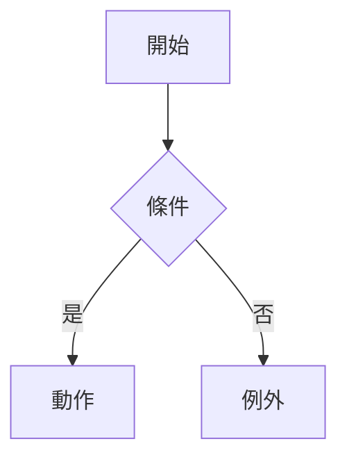
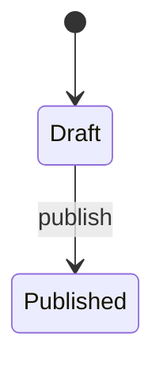
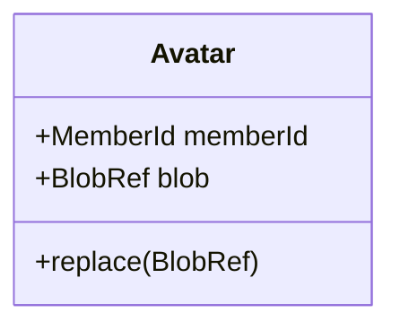

# {feature-title} — 領域模型

## Use Case
### UC-001 {名稱}
- 主流程:
- 替代流程:
- 例外流程:

## 狀態機
<!-- 無 state_heavy 型態時寫「不適用:狀態數 < 3」 -->

## 領域模型
| 類型 | 名稱 | 不變量 | 所屬 Aggregate |
|---|---|---|---|
| Aggregate Root | | | |
| Entity | | | |
| Value Object | | | |
| Domain Event | | | |

