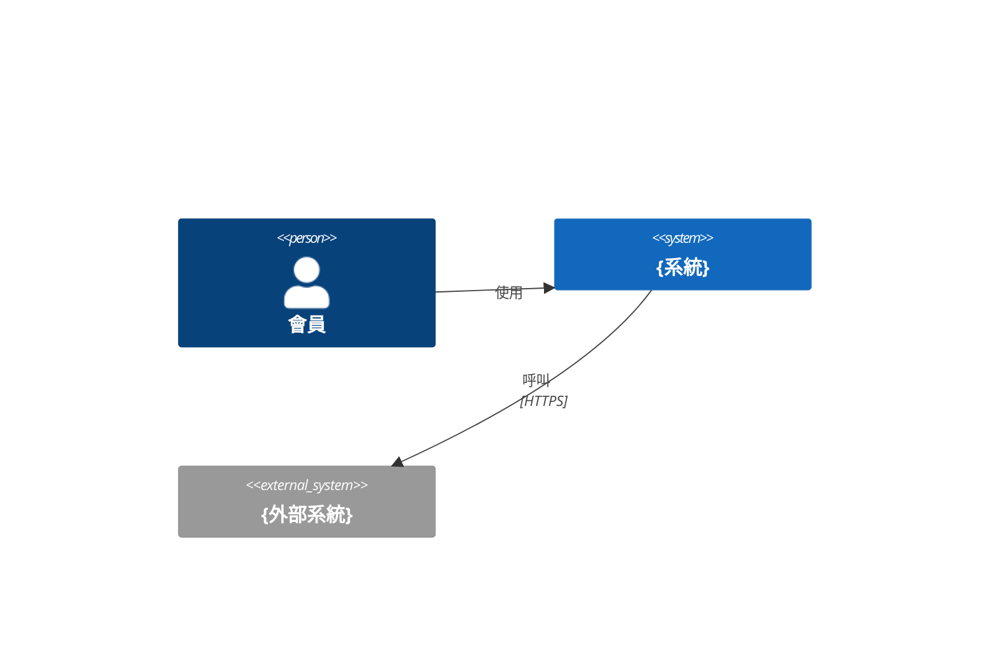
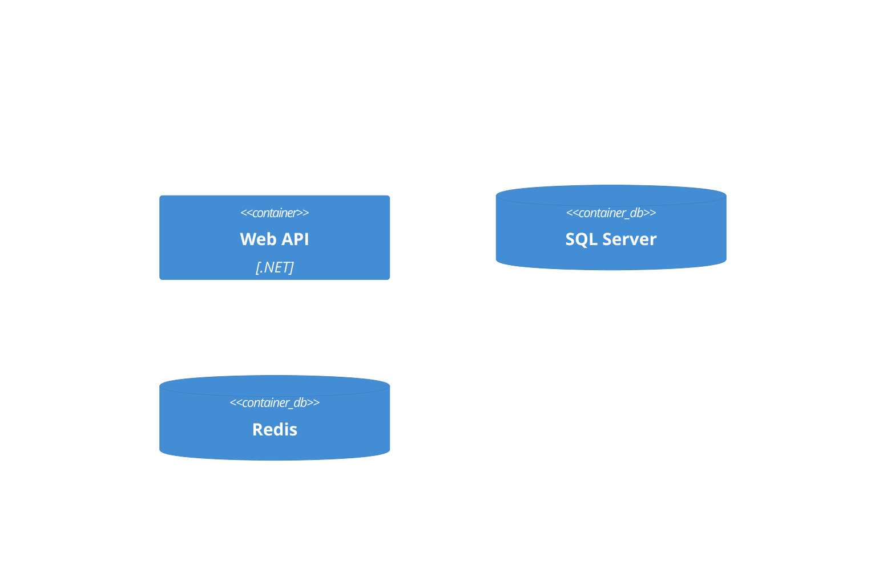
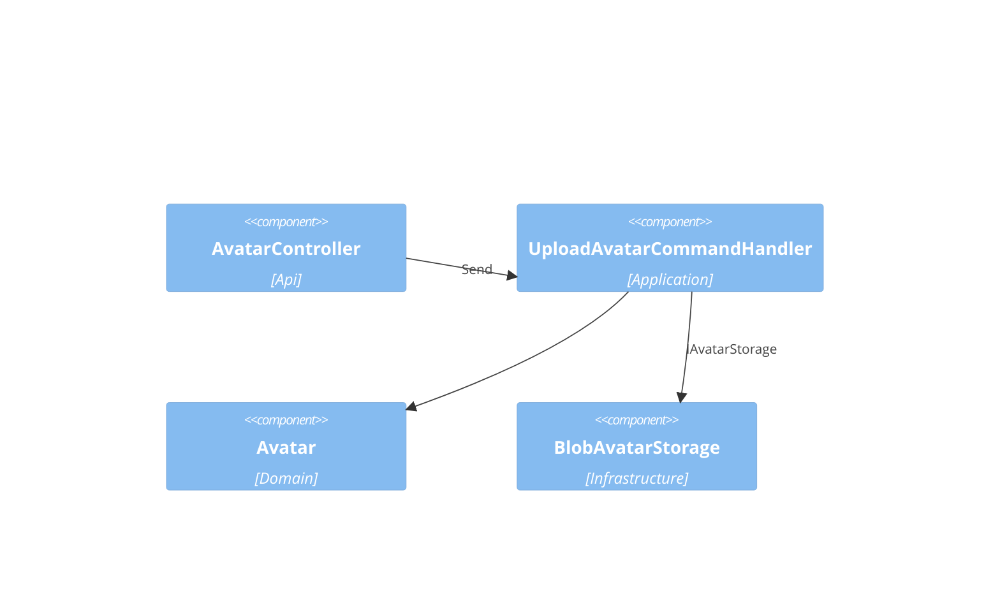
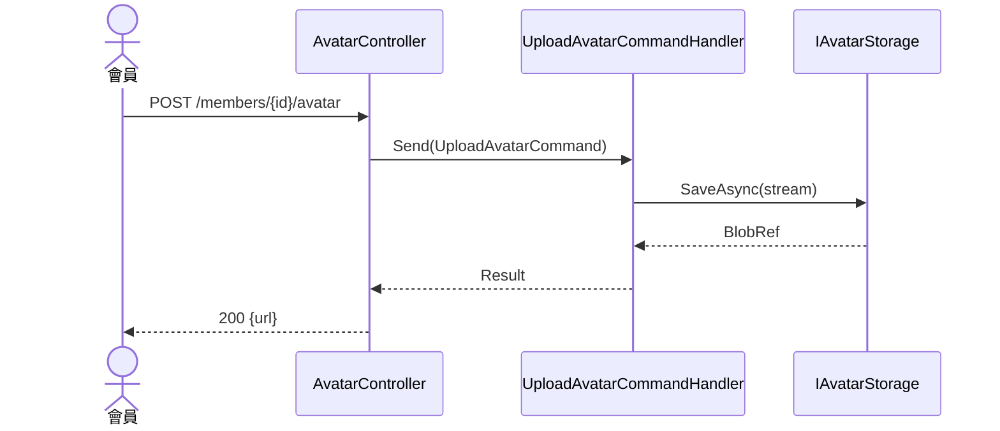

# {feature-title} — 架構(C4)

## Context(L1)

## Container(L2)

## Component(L3)
| ID | 名稱 | Layer | Context | depends | external | 技術 |
|---|---|---|---|---|---|---|
| CMP-001 | AvatarController | Api | Member | CMP-002 | | ASP.NET Core |
| CMP-002 | UploadAvatarCommandHandler | Application | Member | CMP-003, CMP-004 | | MediatR |
| CMP-003 | Avatar (Aggregate) | Domain | Member | | | |
| CMP-004 | IAvatarStorage → BlobAvatarStorage | Infrastructure | Member | | AzureBlob | Azure.Storage.Blobs |

## Sequence
### SEQ-001(對應 UC-001)

