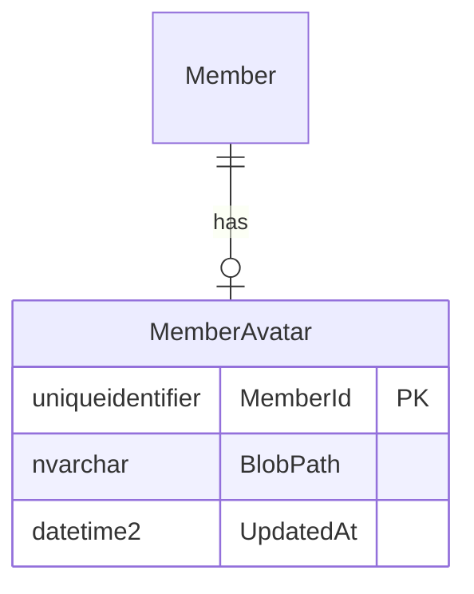

# {feature-title} — 資料模型

## 資料表

| 表 | 欄位 | 型別 | 鍵/索引 | 說明 |
|---|---|---|---|---|

## 擁有權
| 表 | Owner Context | 其他 Context 存取方式 |
|---|---|---|
| MemberAvatar | Member | 經 API-001 |

## 遷移
- 新增表/欄位:
- 既有資料處理:
- 保留期:
