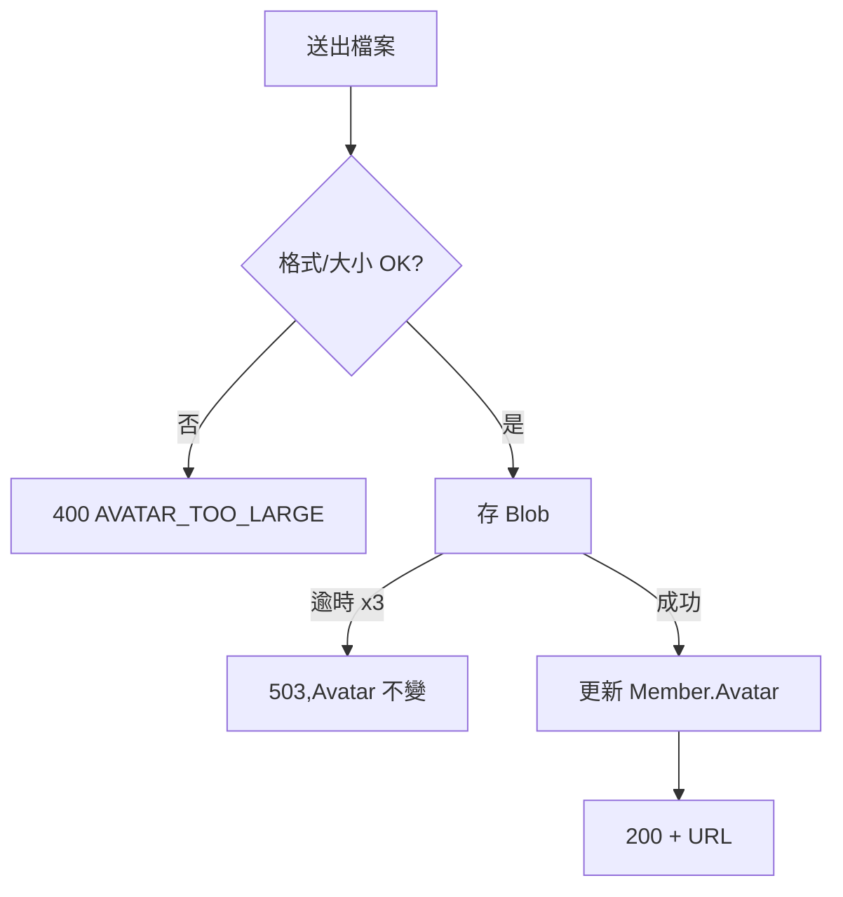
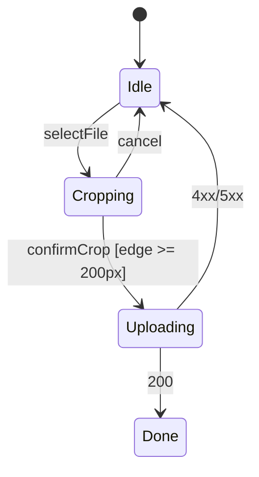
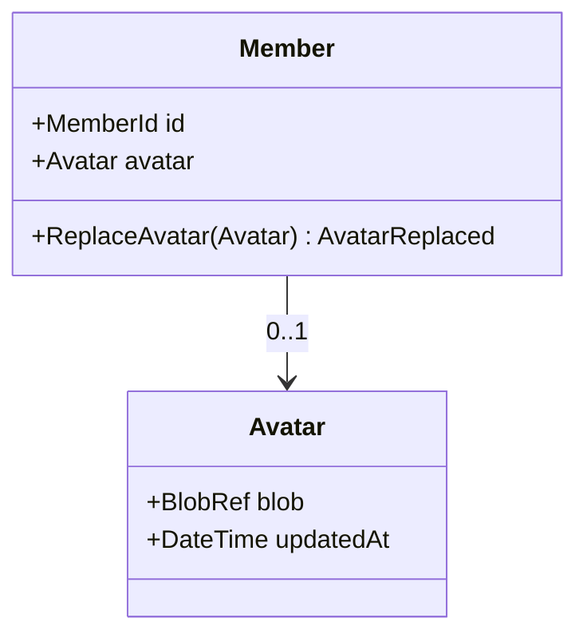

# 會員上傳大頭貼 — 領域模型

## Use Case
### UC-001 上傳大頭貼(REQ-001)
- 主要參與者:會員
- 觸發:會員在個人頁點「更換頭像」並選檔
- 前置條件:已登入;檔案為 jpg/png
- 後置條件(成功保證):Member.Avatar 指向新 BlobRef;舊 Blob 排程刪除;失敗時 Member.Avatar 不變
- 主流程:
  1. 會員送出檔案
  2. 系統檢查格式與大小(≤ 5MB)
  3. 系統存入 Blob,取得 BlobRef
  4. 系統更新 Member.Avatar
  5. 回傳頭像 URL
- 替代流程:無
- 例外流程:2a 檔案過大 → 400;3a Blob 逾時 → 重試 3 次後 503,Avatar 不變

### UC-002 裁切頭像(REQ-002)
- 主要參與者:會員
- 觸發:選檔後進入裁切畫面
- 前置條件:已選檔
- 後置條件(成功保證):送出的影像為正方形且邊長 ≥ 200px
- 主流程:
  1. 顯示圖片與框選框
  2. 會員拖曳框選
  3. 確認後前端裁切並送出
- 替代流程:取消 → 回到選檔
- 例外流程:框選 < 200px → 確認鈕停用

### UC-003 顯示頭像(REQ-003)
- 主要參與者:任何瀏覽個人頁的人
- 觸發:開啟個人頁
- 前置條件:無
- 後置條件(成功保證):有頭像顯示 SAS URL;無頭像顯示預設圖
- 主流程:
  1. 查詢 Member.Avatar
  2. 有 → 產生 SAS URL;無 → 預設圖 URL

## 狀態機
領域狀態機:不適用。Avatar 只有「有/無」兩態,不持久化中間狀態。

### 介面狀態
### STM-UI-001 上傳畫面(REQ-002)

## 領域模型
Avatar 沒有自己的生命週期,也沒有跨物件一致性約束,所以**不建 Aggregate**;它是 Member Aggregate 的 Value Object。

| 類型 | 名稱 | 不變量 | 所屬 Aggregate | 來源 UC 後置條件 |
|---|---|---|---|---|
| Aggregate Root | Member | 一個會員至多一個 Avatar | Member | UC-001 |
| Value Object | Avatar(BlobRef, UpdatedAt) | 影像為正方形、邊長 ≥ 200px、≤ 5MB | Member | UC-001, UC-002 |
| Domain Event | AvatarReplaced(MemberId, OldBlobRef) | 舊 Blob 必須被排程刪除 | Member | UC-001 |

### CLS-001 Member(REQ-001)

