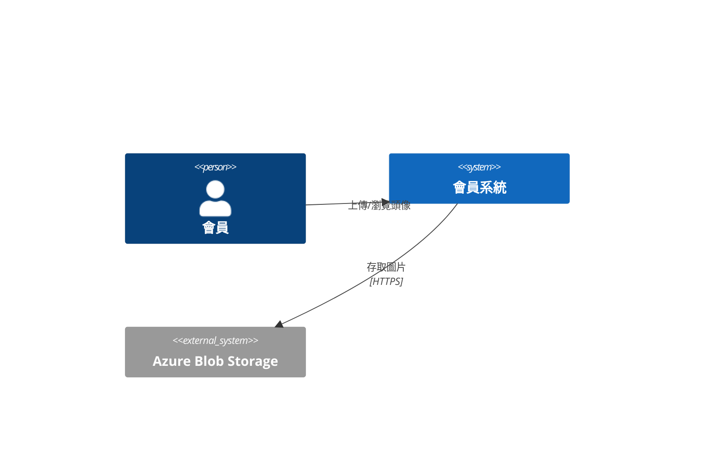
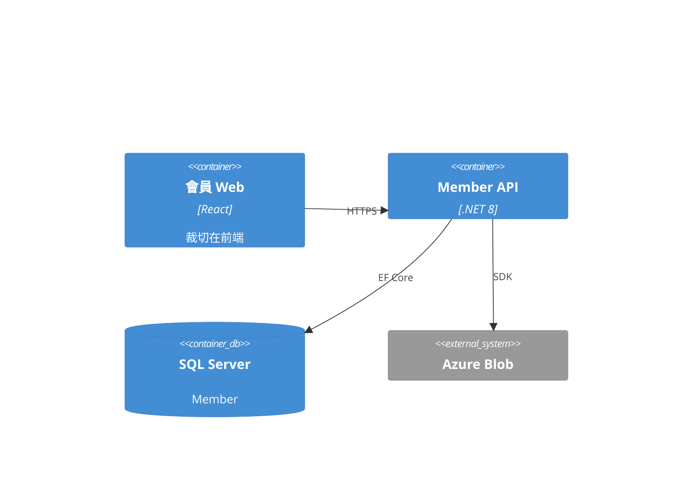
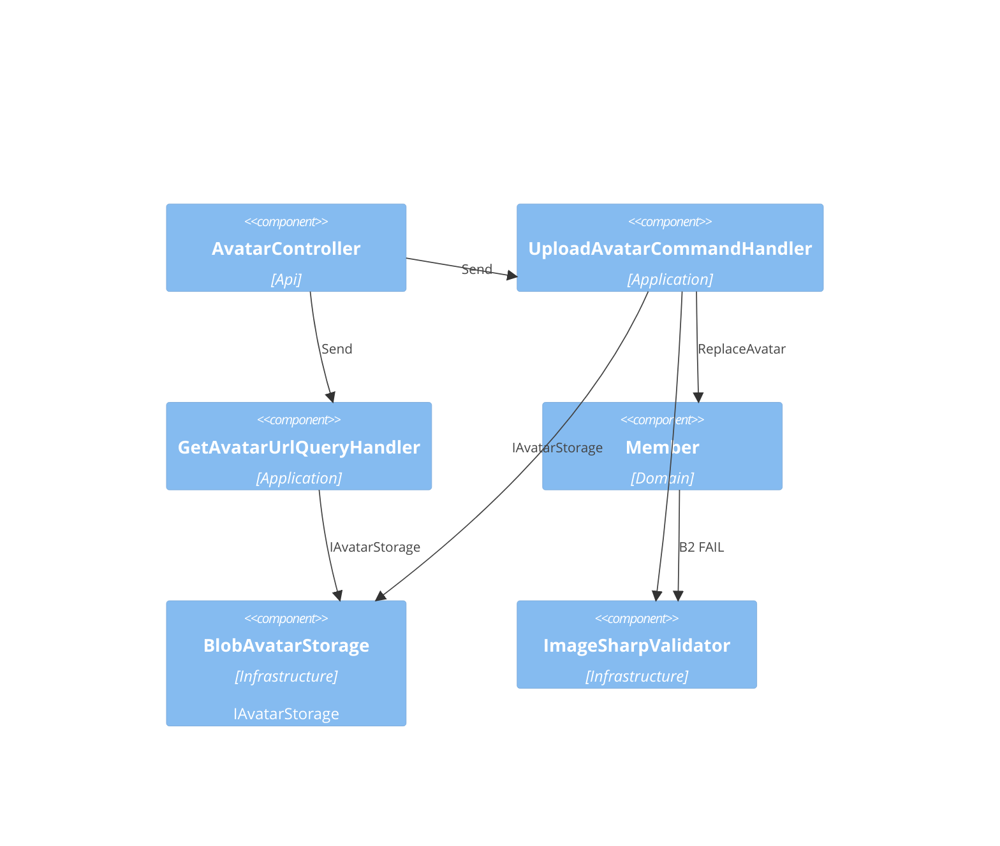
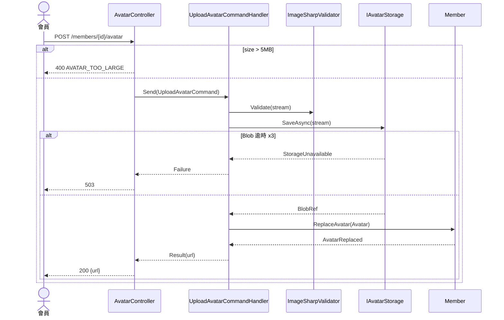

# 會員上傳大頭貼 — 架構(C4)

## Context(L1)
### C4-L1

## Container(L2)
### C4-L2

## Component(L3)
| ID | 名稱 | Layer | Context | depends | external | 技術 |
|---|---|---|---|---|---|---|
| CMP-001 | AvatarController | Api | Member | CMP-002, CMP-006 | | ASP.NET Core |
| CMP-002 | UploadAvatarCommandHandler | Application | Member | CMP-003, CMP-004, CMP-005 | | MediatR |
| CMP-003 | Member (Aggregate) | Domain | Member | CMP-005 | | |
| CMP-004 | BlobAvatarStorage : IAvatarStorage | Infrastructure | Member | | AzureBlob | Azure.Storage.Blobs |
| CMP-005 | ImageSharpValidator | Infrastructure | Member | | | SixLabors.ImageSharp |
| CMP-006 | GetAvatarUrlQueryHandler | Application | Member | CMP-004 | | MediatR |

### C4-L3

## 追溯(AC → 技術元件)
| AC | CMP | via | 職責 |
|---|---|---|---|
| AC-001-1 | CMP-001 | SEQ-001 | 接收 multipart,回 200 + URL |
| AC-001-1 | CMP-002 | SEQ-001 | 編排:驗證 → 存 Blob → ReplaceAvatar |
| AC-001-1 | CMP-003 | SEQ-001 | ReplaceAvatar,發 AvatarReplaced |
| AC-001-1 | CMP-004 | SEQ-001 | 存 Blob,回 BlobRef |
| AC-001-2 | CMP-001 | SEQ-001 | 格式檢查:大小 > 5MB → 400 |
| AC-001-3 | CMP-004 | SEQ-001 | 逾時重試 3 次後丟 StorageUnavailable |
| AC-001-3 | CMP-002 | SEQ-001 | 捕捉 StorageUnavailable → 503,不呼叫 ReplaceAvatar |
| AC-002-1 | CMP-005 | UC-002 | 後端再驗一次正方形與 ≥ 200px |
| AC-002-1 | CMP-003 | UC-002 | Avatar VO 不變量 |
| AC-003-1 | CMP-006 | UC-003 | 無 Avatar 回預設圖 URL |

## Sequence
### SEQ-001 上傳(UC-001 / REQ-001)

