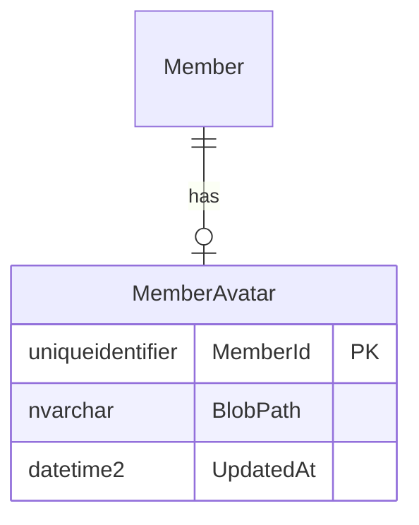

# 會員上傳大頭貼 — 資料模型

## 資料表
### ERD-001

| 表 | 欄位 | 型別 | 鍵/索引 | 說明 |
|---|---|---|---|---|
| MemberAvatar | MemberId | uniqueidentifier | PK, FK→Member | |
| MemberAvatar | BlobPath | nvarchar(512) | | 容器內路徑,不含 SAS |
| MemberAvatar | UpdatedAt | datetime2 | | |

## 擁有權
| 表 | Owner Context | 其他 Context 存取方式 |
|---|---|---|
| MemberAvatar | Member | 經 API-002 |

## 遷移
- 新增表:MemberAvatar
- 既有資料處理:無(新功能)
- 保留期:會員刪除時連帶刪 Blob(AvatarReplaced / MemberDeleted 事件)
