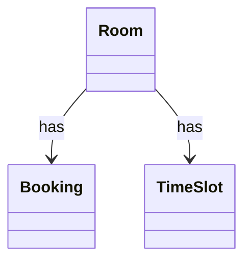

# SA2 Entities / Relations

## Entities
| Entity | Symbol | Attributes | Source Words |
|---|---|---|---|
| meeting room | Room | Id | meeting room |
| booking | Booking | Id, Status | booking |
| time slot | TimeSlot | Id | time slot |

## Relations
| Source | Relation | Target | Multiplicity |
|---|---|---|---|
| Room | has | Booking | 1..* |
| Room | has | TimeSlot | 1..* |

### CLS-SA-001 (REQ-001)

