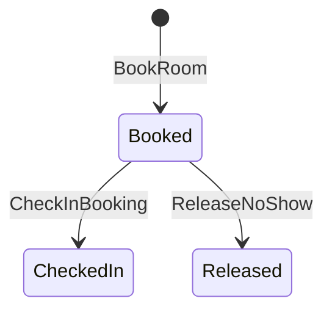
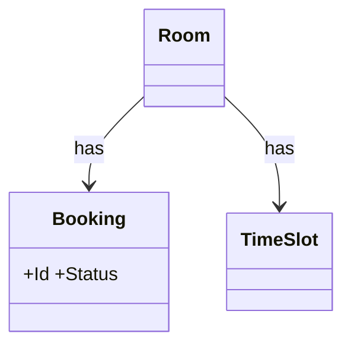

# Meeting room booking — domain model

## Use Cases
### UC-001 An employee can book a meeting room without overlapping time slot (REQ-001)
- Primary actor: employee
- Trigger: the employee books the meeting room
- Precondition: the time slot is free
- Postcondition (success guarantee): a booking is booked
- Main flow:
  1. the employee books the meeting room
  2. a booking is booked
- Alternative flow: none
- Exception flow: the response is 409 SLOT_TAKEN

### UC-002 check in within 15 minutes or the system will release the meeting room (REQ-002)
- Primary actor: employee
- Trigger: the employee checks in within 15 minutes
- Precondition: a booking is booked
- Postcondition (success guarantee): the booking is checked-in
- Main flow:
  1. the employee checks in within 15 minutes
  2. the booking is checked-in
- Alternative flow: none
- Exception flow: the booking is released and the calendar service is updated

### UC-003 An admin can view daily booking records (REQ-003)
- Primary actor: admin
- Trigger: the admin opens the daily view
- Precondition: booking records exist today
- Postcondition (success guarantee): rows are grouped by meeting room
- Main flow:
  1. the admin opens the daily view
  2. rows are grouped by meeting room
- Alternative flow: none
- Exception flow: none

## State Machines
### STM-DOM-001 Booking.Status (REQ-001)

## Domain Model
| Type | Name | Invariant |
|---|---|---|
| Aggregate Root | Booking | Status: Booked → CheckedIn → Released |
| Entity | Room | — |
| Entity | TimeSlot | — |

### CLS-001 Booking (REQ-001)

