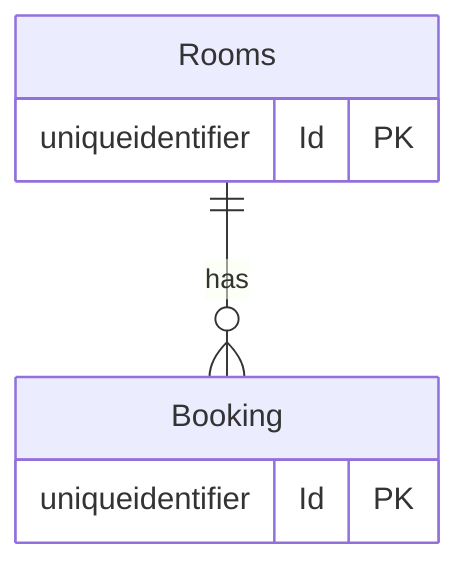

# Meeting room booking — data model

## Tables
### ERD-001

```mermaid
erDiagram
  Rooms ||--o{ Booking : has
  Rooms {
    uniqueidentifier Id PK
  }
  Booking {
    uniqueidentifier Id PK
  }
```

## Ownership
| Table | Owner Context | Access From Other Contexts |
|---|---|---|
| Rooms | Rooms | — |
| Booking | Rooms | — |
