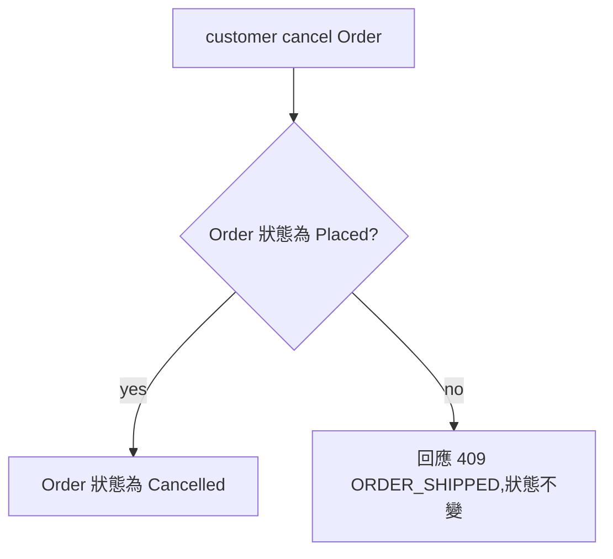

# SA5 Activity Diagram

## Activity Diagram
### ACT-001 (REQ-001)

```mermaid
flowchart TD
  A["customer cancel Order"] --> B{"Order 狀態為 Placed?"}
  B -->|yes| C["Order 狀態為 Cancelled"]
  B -->|no| D["回應 409 ORDER_SHIPPED,狀態不變"]
```
