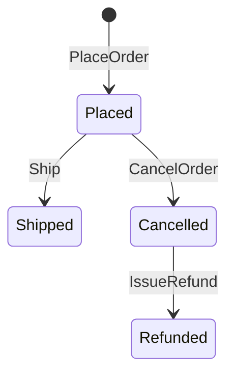
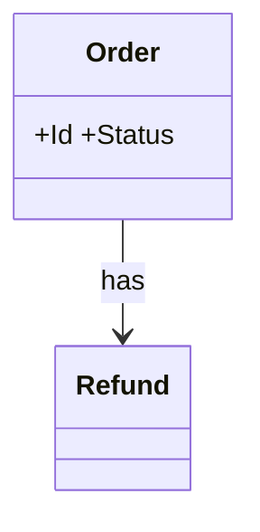

# 訂單取消與退款 — domain model

## Use Case
### UC-001 customer 可在出貨前 cancel Order (REQ-001)
- 主要參與者: customer
- 觸發: customer cancel Order
- 前置條件: Order 狀態為 Placed
- 後置條件(成功保證): Order 狀態為 Cancelled
- 主流程:
  1. customer cancel Order
  2. Order 狀態為 Cancelled
- 替代流程: 無
- 例外流程: 回應 409 ORDER_SHIPPED,狀態不變

### UC-002 cancel 後 system 經 PaymentGateway refund (REQ-002)
- 主要參與者: system
- 觸發: system refund
- 前置條件: Order 已 cancel 且已付款
- 後置條件(成功保證): 呼叫 PaymentGateway, Order 狀態為 Refunded
- 主流程:
  1. system refund
  2. 呼叫 PaymentGateway, Order 狀態為 Refunded
- 替代流程: 無
- 例外流程: 重試 3 次, Order 維持 Cancelled

### UC-003 support agent 可 view cancel 紀錄 (REQ-003)
- 主要參與者: support agent
- 觸發: support agent 開啟紀錄
- 前置條件: 有 Order 已 cancel
- 後置條件(成功保證): 每列顯示 Order、時間與原因
- 主流程:
  1. support agent 開啟紀錄
  2. 每列顯示 Order、時間與原因
- 替代流程: 無
- 例外流程: 無

## 狀態機
### STM-DOM-001 Order.Status (REQ-001)

## 領域模型
| 類型 | 名稱 | 不變量 |
|---|---|---|
| Aggregate Root | Order | Status: Placed → Shipped → Cancelled → Refunded |
| Entity | Refund | — |

### CLS-001 Order (REQ-001)

