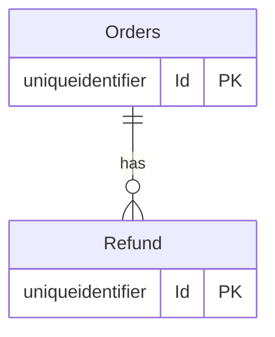

# 訂單取消與退款 — data model

## 資料表
### ERD-001

```mermaid
erDiagram
  Orders ||--o{ Refund : has
  Orders {
    uniqueidentifier Id PK
  }
  Refund {
    uniqueidentifier Id PK
  }
```

## 擁有權
| 表 | Owner Context | 其他 Context 存取方式 |
|---|---|---|
| Orders | Orders | — |
| Refund | Orders | — |
