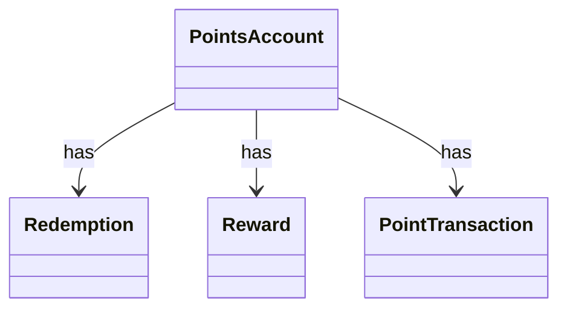

# SA2 實體 / 關係

## 實體
| 實體 | 英文 | 屬性 | 來源詞 |
|---|---|---|---|
| 點數帳戶 | PointsAccount | Id | 點數帳戶 |
| 兌換單 | Redemption | Id, Status | 兌換單 |
| 獎品 | Reward | Id | 獎品 |
| 點數交易 | PointTransaction | Id | 點數交易 |

## 關係
| 來源 | 關係 | 目標 | 多重性 |
|---|---|---|---|
| PointsAccount | has | Redemption | 1..* |
| PointsAccount | has | Reward | 1..* |
| PointsAccount | has | PointTransaction | 1..* |

### CLS-SA-001 (REQ-001)

