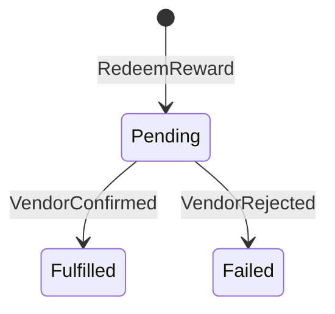
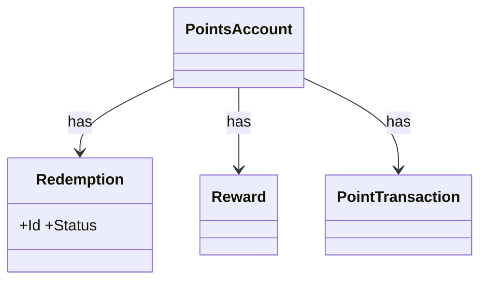

# 會員點數兌換 — domain model

## Use Case
### UC-001 點數帳戶點數足夠時會員可兌換獎品 (REQ-001)
- 主要參與者: 會員
- 觸發: 會員兌換獎品
- 前置條件: 餘額足夠
- 後置條件(成功保證): 建立兌換單並呼叫獎品供應商
- 主流程:
  1. 會員兌換獎品
  2. 建立兌換單並呼叫獎品供應商
- 替代流程: 無
- 例外流程: 回應 422 INSUFFICIENT_POINTS,不扣點

### UC-002 點數 12 個月後到期 (REQ-002)
- 主要參與者: 系統
- 觸發: 每月排程執行
- 前置條件: 點數於 13 個月前取得
- 後置條件(成功保證): 寫入到期點數交易,餘額減少
- 主流程:
  1. 每月排程執行
  2. 寫入到期點數交易,餘額減少
- 替代流程: 無
- 例外流程: 無

### UC-003 會員可查看點數交易 (REQ-003)
- 主要參與者: 會員
- 觸發: 會員開啟紀錄
- 前置條件: 會員有點數交易
- 後置條件(成功保證): 每筆點數交易顯示日期、類型、點數
- 主流程:
  1. 會員開啟紀錄
  2. 每筆點數交易顯示日期、類型、點數
- 替代流程: 無
- 例外流程: 無

## 狀態機
### STM-DOM-001 Redemption.Status (REQ-001)

## 領域模型
| 類型 | 名稱 | 不變量 |
|---|---|---|
| Aggregate Root | Redemption | Status: Pending → Fulfilled → Failed |
| Entity | PointsAccount | — |
| Entity | Reward | — |
| Entity | PointTransaction | — |

### CLS-001 Redemption (REQ-001)

