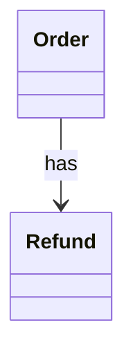

# SA2 Entities / Relations

## Entities
| Entity | Symbol | Attributes | Source Words |
|---|---|---|---|
| order | Order | Id, Status | order |
| refund | Refund | Id | refund |

## Relations
| Source | Relation | Target | Multiplicity |
|---|---|---|---|
| Order | has | Refund | 1..* |

### CLS-SA-001 (REQ-001)

