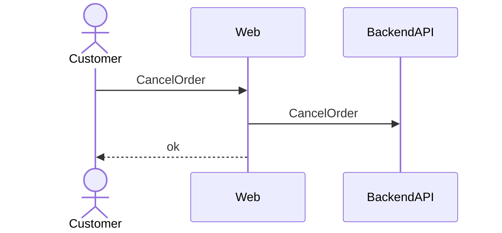
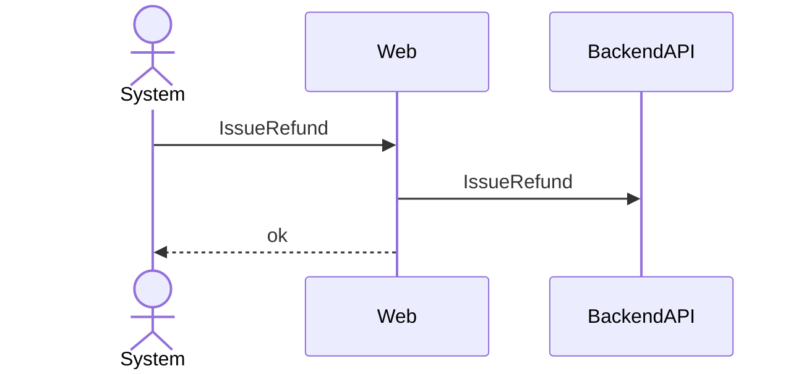
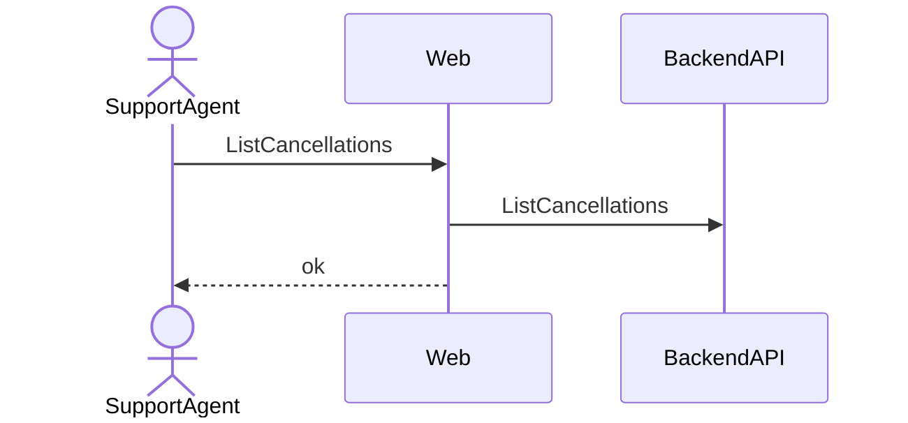

# SA6 Sequence Diagram

## Sequence Diagram
### SEQ-SA-001 (REQ-001)

```mermaid
sequenceDiagram
  actor U as Customer
  participant Web
  participant BackendAPI
  U->>Web: CancelOrder
  Web->>BackendAPI: CancelOrder
  Web-->>U: ok
```

### SEQ-SA-002 (REQ-002)

```mermaid
sequenceDiagram
  actor U as System
  participant Web
  participant BackendAPI
  U->>Web: IssueRefund
  Web->>BackendAPI: IssueRefund
  Web-->>U: ok
```

### SEQ-SA-003 (REQ-003)

```mermaid
sequenceDiagram
  actor U as SupportAgent
  participant Web
  participant BackendAPI
  U->>Web: ListCancellations
  Web->>BackendAPI: ListCancellations
  Web-->>U: ok
```

