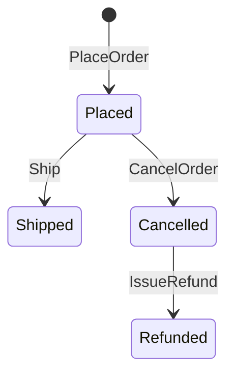
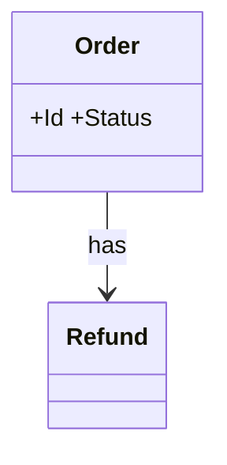

# Order cancellation and refund — domain model

## Use Cases
### UC-001 A customer can cancel an order before it is shipped (REQ-001)
- Primary actor: customer
- Trigger: the customer cancels it
- Precondition: an order is placed
- Postcondition (success guarantee): the order status is cancelled
- Main flow:
  1. the customer cancels it
  2. the order status is cancelled
- Alternative flow: none
- Exception flow: the response is 409 ORDER_SHIPPED and the status is unchanged

### UC-002 The system issues a refund through the payment gateway after cancellation (REQ-002)
- Primary actor: system
- Trigger: the system issues the refund
- Precondition: an order is cancelled and paid
- Postcondition (success guarantee): the payment gateway is called and the order is refunded
- Main flow:
  1. the system issues the refund
  2. the payment gateway is called and the order is refunded
- Alternative flow: none
- Exception flow: it retries 3 times and the order stays cancelled

### UC-003 A support agent can view the cancellation history (REQ-003)
- Primary actor: support agent
- Trigger: the support agent opens the history
- Precondition: order records were cancelled
- Postcondition (success guarantee): each row shows the order, time and reason
- Main flow:
  1. the support agent opens the history
  2. each row shows the order, time and reason
- Alternative flow: none
- Exception flow: none

## State Machines
### STM-DOM-001 Order.Status (REQ-001)

## Domain Model
| Type | Name | Invariant |
|---|---|---|
| Aggregate Root | Order | Status: Placed → Shipped → Cancelled → Refunded |
| Entity | Refund | — |

### CLS-001 Order (REQ-001)

