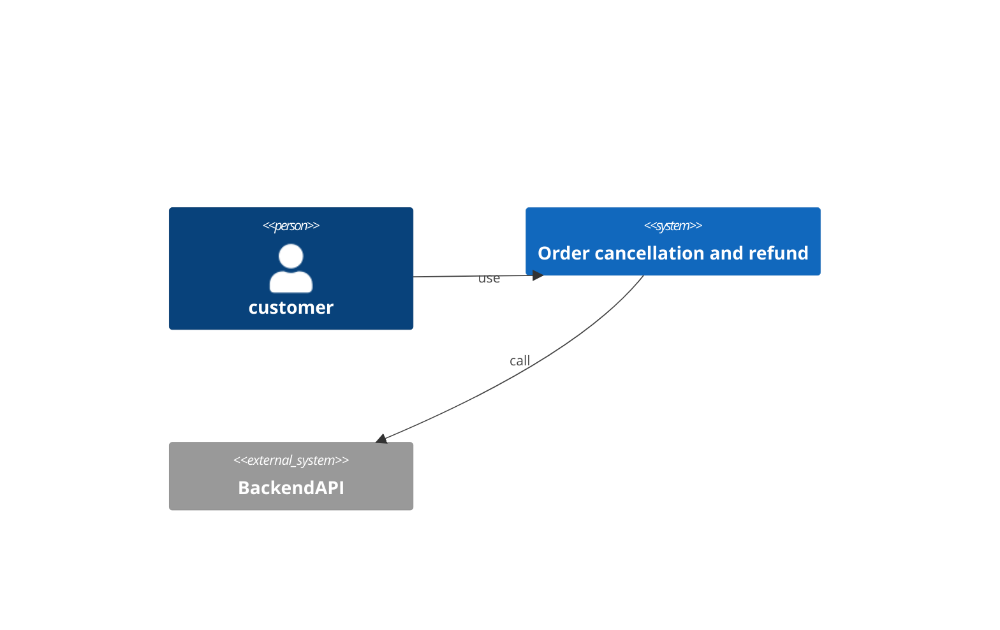
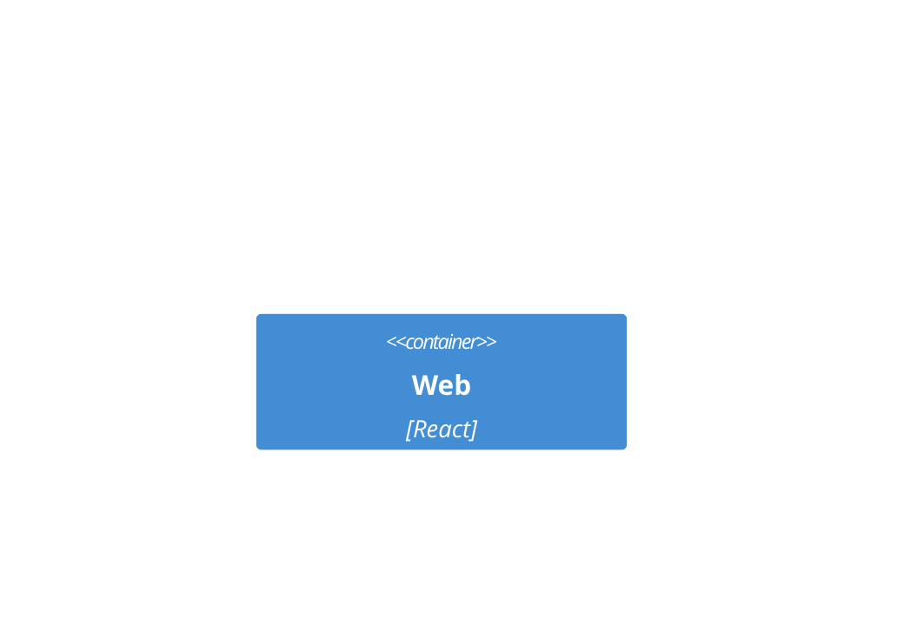
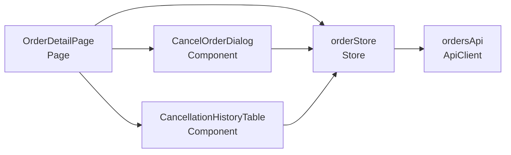
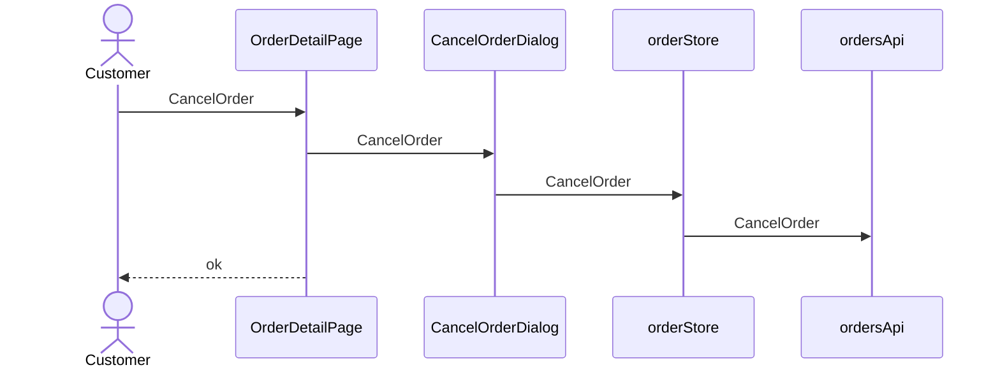

# Order cancellation and refund — architecture (C4)

## Context (L1)
### C4-L1

## Container (L2)
### C4-L2

## Component (L3)
| ID | Name | Layer | Context | depends | external | Tech |
|---|---|---|---|---|---|---|
| CMP-001 | OrderDetailPage | Page | Orders | CMP-002, CMP-003, CMP-004 |  | React |
| CMP-002 | CancelOrderDialog | Component | Orders | CMP-004 |  | React |
| CMP-003 | CancellationHistoryTable | Component | Orders | CMP-004 |  | React |
| CMP-004 | orderStore | Store | Orders | CMP-005 |  | Zustand |
| CMP-005 | ordersApi | ApiClient | Orders |  | BackendAPI |  |

### C4-L3

## Traceability
| AC | CMP | via | Responsibility |
|---|---|---|---|
| AC-001-1 | CMP-001 | SEQ-001 | render and trigger cancel |
| AC-001-1 | CMP-002 | SEQ-001 | UI guard for cancel |
| AC-001-1 | CMP-004 | SEQ-001 | client state transition for cancel |
| AC-001-1 | CMP-005 | SEQ-001 | call the API for cancel |
| AC-001-2 | CMP-001 | SEQ-001 | render and trigger cancel |
| AC-001-2 | CMP-002 | SEQ-001 | UI guard for cancel |
| AC-001-2 | CMP-004 | SEQ-001 | client state transition for cancel |
| AC-001-2 | CMP-005 | SEQ-001 | call the API for cancel |
| AC-002-1 | CMP-001 | SEQ-001 | render and trigger refund |
| AC-002-1 | CMP-004 | SEQ-001 | client state transition for refund |
| AC-002-1 | CMP-005 | SEQ-001 | call the API for refund |
| AC-002-2 | CMP-001 | SEQ-001 | render and trigger refund |
| AC-002-2 | CMP-004 | SEQ-001 | client state transition for refund |
| AC-002-2 | CMP-005 | SEQ-001 | call the API for refund |
| AC-003-1 | CMP-001 | SEQ-001 | render and trigger view |
| AC-003-1 | CMP-003 | SEQ-001 | UI guard for view |
| AC-003-1 | CMP-004 | SEQ-001 | client state transition for view |
| AC-003-1 | CMP-005 | SEQ-001 | call the API for view |
| AC-N01-1 | CMP-005 | API-002 | NFR P95 < 5 min |

## Sequence
### SEQ-001 (UC-001 / REQ-001)

