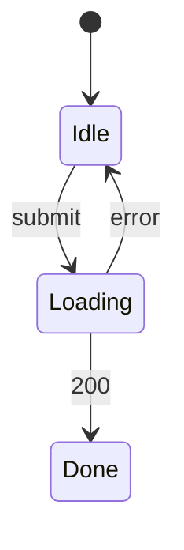

# Order cancellation and refund — UI spec

## Screens
| Screen | Route | Components | Mock | REQ |
|---|---|---|---|---|
| OrderDetailPage | /order | CMP-001, CMP-002, CMP-003, CMP-004, CMP-005 | specs/in-progress/order-cancel/mock/order.html | REQ-001, REQ-002, REQ-003 |

## UI States
### STM-UI-001 OrderDetailPage (REQ-001)

## Field Validation
| Screen | Field | Rule | Error Message | AC Refs |
|---|---|---|---|---|
| OrderDetailPage | CancelOrder | an order is shipped | the response is 409 ORDER_SHIPPED and the status is unchanged | AC-001-2 |
