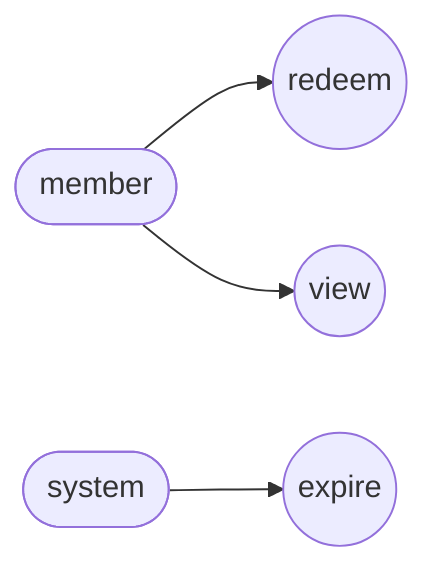

# SA4 Use Case Diagram

## Use Case Diagram
### UCD-001 (REQ-001, REQ-002, REQ-003)

```mermaid
flowchart LR
  member(["member"]) --> redeem(("redeem"))
  system(["system"]) --> expire(("expire"))
  member(["member"]) --> view_tx(("view"))
```
