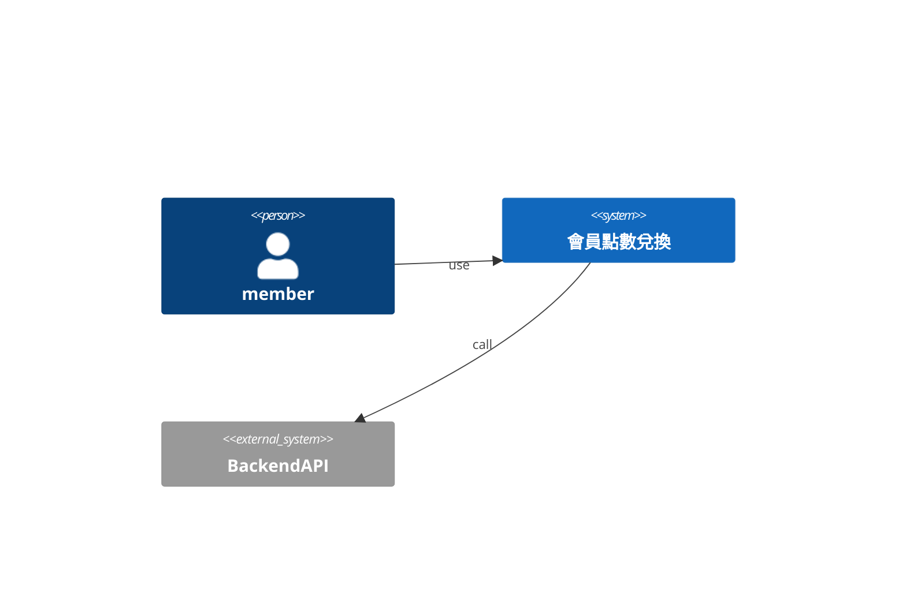
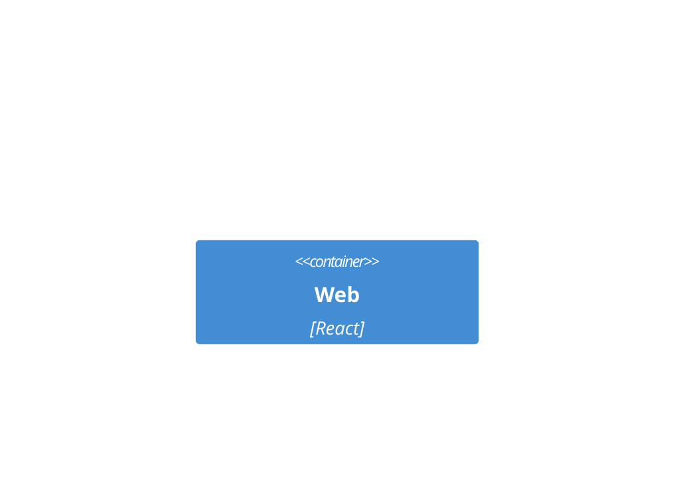
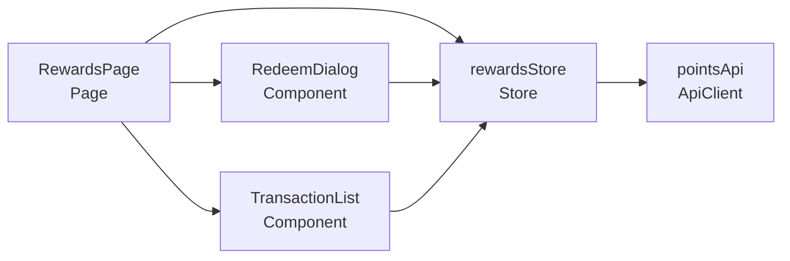
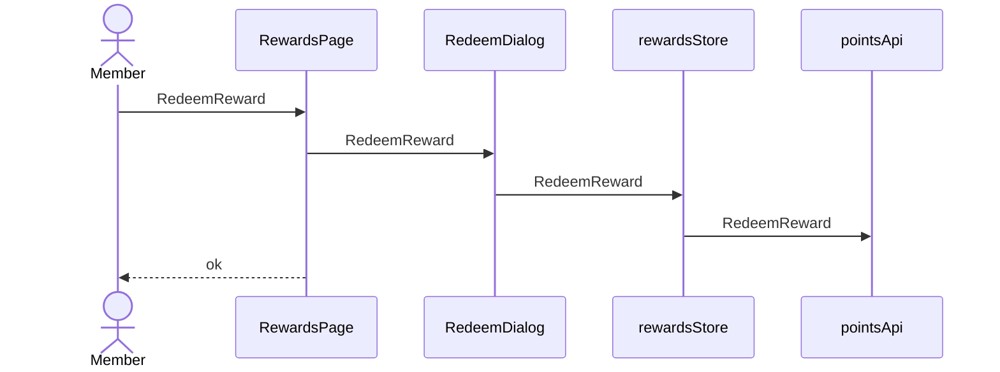

# 會員點數兌換 — architecture (C4)

## Context(L1)
### C4-L1

## Container(L2)
### C4-L2

## Component(L3)
| ID | 名稱 | Layer | Context | depends | external | 技術 |
|---|---|---|---|---|---|---|
| CMP-001 | RewardsPage | Page | Loyalty | CMP-002, CMP-003, CMP-004 |  | React |
| CMP-002 | RedeemDialog | Component | Loyalty | CMP-004 |  | React |
| CMP-003 | TransactionList | Component | Loyalty | CMP-004 |  | React |
| CMP-004 | rewardsStore | Store | Loyalty | CMP-005 |  | Zustand |
| CMP-005 | pointsApi | ApiClient | Loyalty |  | BackendAPI |  |

### C4-L3

## 追溯(AC → 技術元件)
| AC | CMP | via | 職責 |
|---|---|---|---|
| AC-001-1 | CMP-001 | SEQ-001 | 顯示並觸發redeem |
| AC-001-1 | CMP-002 | SEQ-001 | redeem的 UI 守衛 |
| AC-001-1 | CMP-004 | SEQ-001 | redeem的前端狀態轉移 |
| AC-001-1 | CMP-005 | SEQ-001 | 呼叫redeem API |
| AC-001-2 | CMP-001 | SEQ-001 | 顯示並觸發redeem |
| AC-001-2 | CMP-002 | SEQ-001 | redeem的 UI 守衛 |
| AC-001-2 | CMP-004 | SEQ-001 | redeem的前端狀態轉移 |
| AC-001-2 | CMP-005 | SEQ-001 | 呼叫redeem API |
| AC-002-1 | CMP-004 | SEQ-001 | expire的前端狀態轉移 |
| AC-002-1 | CMP-005 | SEQ-001 | 呼叫expire API |
| AC-003-1 | CMP-001 | SEQ-001 | 顯示並觸發view |
| AC-003-1 | CMP-003 | SEQ-001 | view的 UI 守衛 |
| AC-003-1 | CMP-004 | SEQ-001 | view的前端狀態轉移 |
| AC-003-1 | CMP-005 | SEQ-001 | 呼叫view API |
| AC-N01-1 | CMP-005 | API-001 | NFR balance never negative |

## Sequence
### SEQ-001 (UC-001 / REQ-001)

