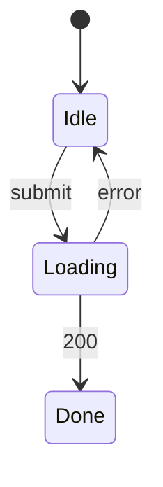

# 會員點數兌換 — UI spec

## 畫面清單
| 畫面 | 路由 | 元件 | Mock | 對應 REQ |
|---|---|---|---|---|
| RewardsPage | /rewards | CMP-001, CMP-002, CMP-003, CMP-004, CMP-005 | specs/in-progress/points-redemption/mock/rewards.html | REQ-001, REQ-003 |

## 介面狀態
### STM-UI-001 RewardsPage (REQ-001)

## 欄位驗證
| 畫面 | 欄位 | 規則 | 錯誤訊息 | 對應 AC |
|---|---|---|---|---|
| RewardsPage | RedeemReward | 餘額不足 | 回應 422 INSUFFICIENT_POINTS,不扣點 | AC-001-2 |
