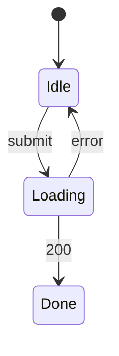

# 會議室預約 — UI spec

## 畫面清單
| 畫面 | 路由 | 元件 | Mock | 對應 REQ |
|---|---|---|---|---|
| RoomBookingPage | /booking | CMP-001, CMP-002, CMP-003, CMP-004, CMP-005, CMP-006 | specs/in-progress/room-booking/mock/booking.html | REQ-001, REQ-002, REQ-003 |

## 介面狀態
### STM-UI-001 RoomBookingPage (REQ-001)

## 欄位驗證
| 畫面 | 欄位 | 規則 | 錯誤訊息 | 對應 AC |
|---|---|---|---|---|
| RoomBookingPage | BookRoom | 時段與其他預約單重疊 | 回應 409 SLOT_TAKEN | AC-001-2 |
