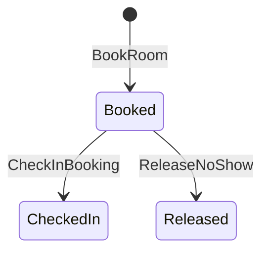
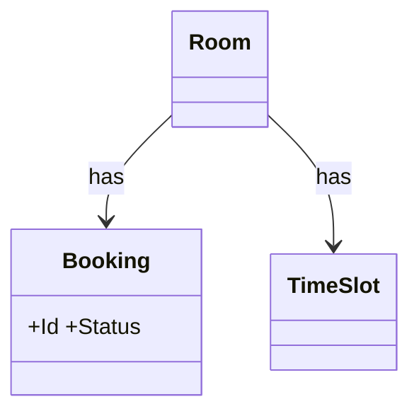

# 會議室預約 — domain model

## Use Case
### UC-001 員工可預約會議室,時段不得重疊 (REQ-001)
- 主要參與者: 員工
- 觸發: 員工預約會議室
- 前置條件: 時段空閒
- 後置條件(成功保證): 預約單狀態為已預約
- 主流程:
  1. 員工預約會議室
  2. 預約單狀態為已預約
- 替代流程: 無
- 例外流程: 回應 409 SLOT_TAKEN

### UC-002 15 分鐘內報到,否則系統釋放會議室 (REQ-002)
- 主要參與者: 員工
- 觸發: 員工在 15 分鐘內報到
- 前置條件: 預約單狀態為已預約
- 後置條件(成功保證): 預約單狀態為已報到
- 主流程:
  1. 員工在 15 分鐘內報到
  2. 預約單狀態為已報到
- 替代流程: 無
- 例外流程: 預約單狀態為已釋放,行事曆服務已更新

### UC-003 管理員可查看每日預約單 (REQ-003)
- 主要參與者: 管理員
- 觸發: 管理員開啟每日檢視
- 前置條件: 今天有預約單
- 後置條件(成功保證): 依會議室分組顯示
- 主流程:
  1. 管理員開啟每日檢視
  2. 依會議室分組顯示
- 替代流程: 無
- 例外流程: 無

## 狀態機
### STM-DOM-001 Booking.Status (REQ-001)

## 領域模型
| 類型 | 名稱 | 不變量 |
|---|---|---|
| Aggregate Root | Booking | Status: Booked → CheckedIn → Released |
| Entity | Room | — |
| Entity | TimeSlot | — |

### CLS-001 Booking (REQ-001)

