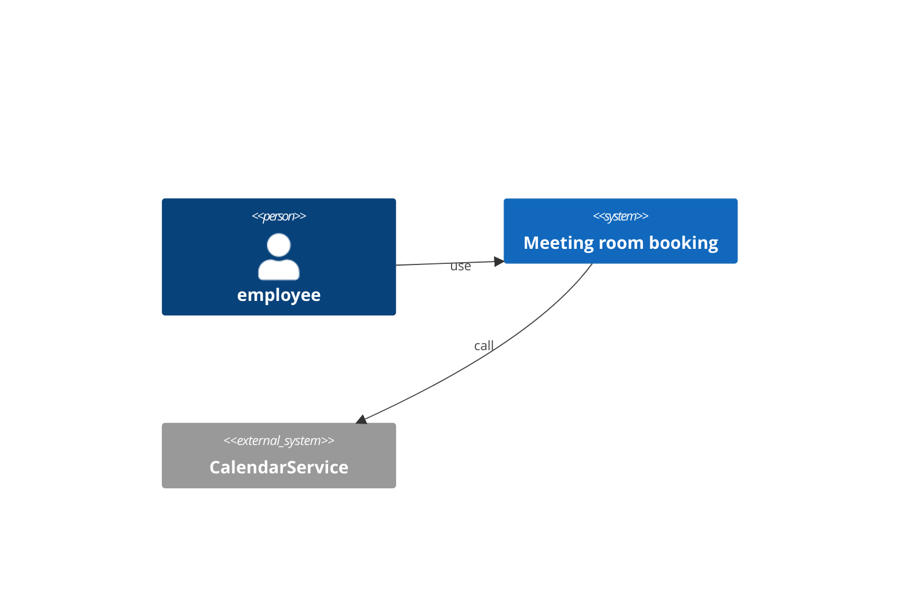
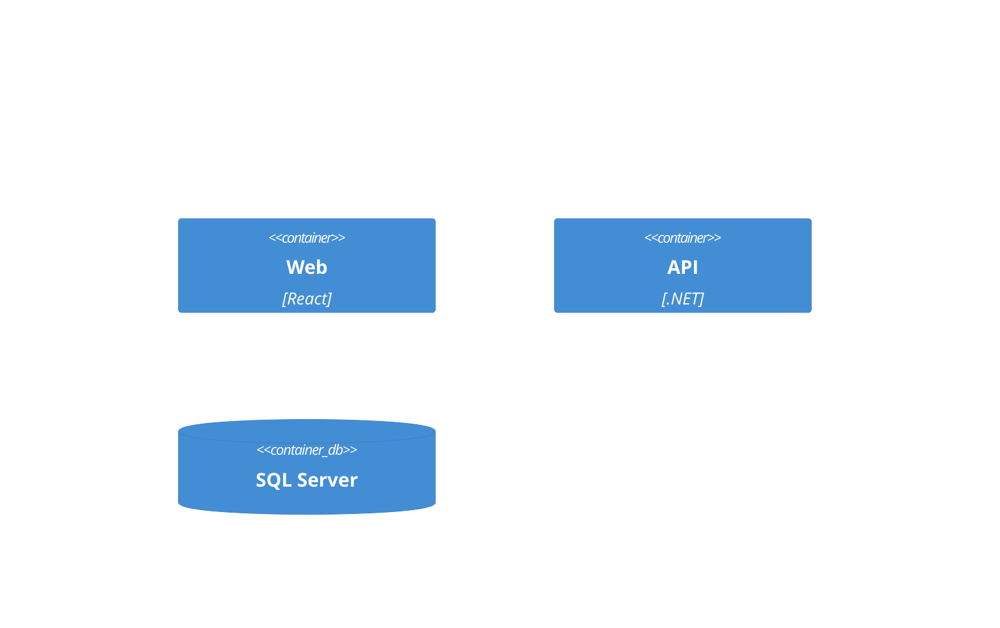
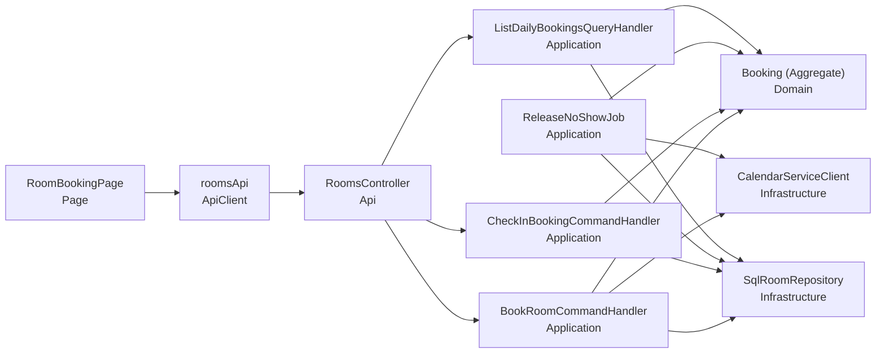
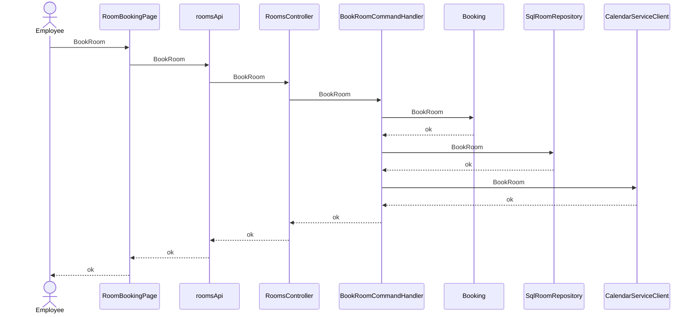
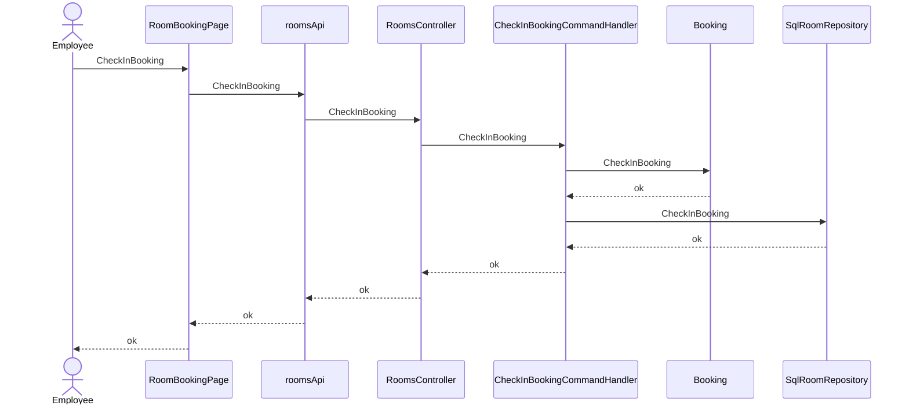
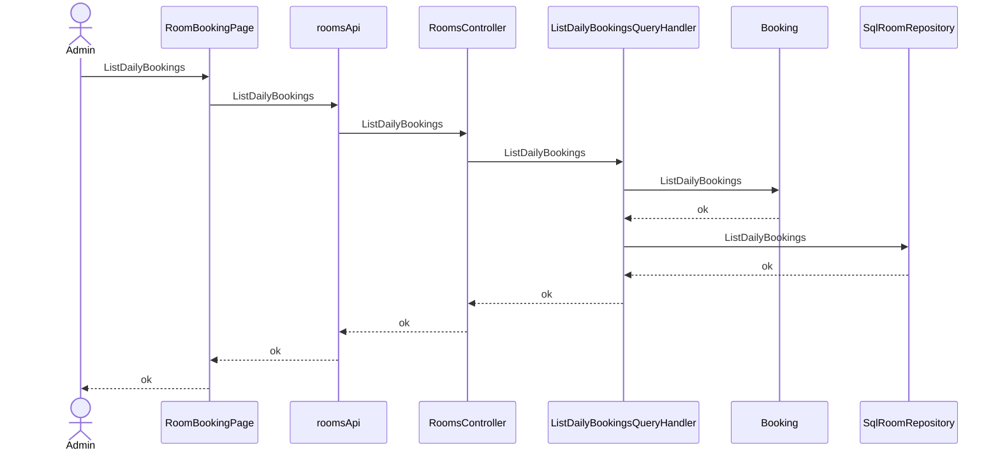

# Meeting room booking — architecture (C4)

## Context (L1)
### C4-L1

## Container (L2)
### C4-L2

## Component (L3)
| ID | Name | Layer | Context | depends | external | Tech |
|---|---|---|---|---|---|---|
| CMP-001 | RoomBookingPage | Page | Rooms | CMP-002 |  | React |
| CMP-002 | roomsApi | ApiClient | Rooms | CMP-003 |  |  |
| CMP-003 | RoomsController | Api | Rooms | CMP-004, CMP-005, CMP-007 |  | ASP.NET Core |
| CMP-004 | BookRoomCommandHandler | Application | Rooms | CMP-008, CMP-009, CMP-010 |  | MediatR |
| CMP-005 | CheckInBookingCommandHandler | Application | Rooms | CMP-008, CMP-009 |  | MediatR |
| CMP-006 | ReleaseNoShowJob | Application | Rooms | CMP-008, CMP-009, CMP-010 |  | ASP.NET Core |
| CMP-007 | ListDailyBookingsQueryHandler | Application | Rooms | CMP-008, CMP-009 |  | MediatR |
| CMP-008 | Booking (Aggregate) | Domain | Rooms |  |  |  |
| CMP-009 | SqlRoomRepository : IRoomRepository | Infrastructure | Rooms |  |  | EF Core |
| CMP-010 | CalendarServiceClient : ICalendarService | Infrastructure | Rooms |  | CalendarService |  |

### C4-L3

## Traceability
| AC | CMP | via | Responsibility |
|---|---|---|---|
| AC-001-1 | CMP-001 | SEQ-001 | render and trigger book |
| AC-001-1 | CMP-002 | SEQ-001 | call the API for book |
| AC-001-1 | CMP-003 | SEQ-001 | receive the book request |
| AC-001-1 | CMP-004 | SEQ-001 | orchestrate book |
| AC-001-1 | CMP-008 | SEQ-001 | enforce the book invariant |
| AC-001-1 | CMP-009 | SEQ-001 | persist the book result |
| AC-001-1 | CMP-010 | SEQ-001 | call the external system for book |
| AC-001-2 | CMP-001 | SEQ-001 | render and trigger book |
| AC-001-2 | CMP-002 | SEQ-001 | call the API for book |
| AC-001-2 | CMP-003 | SEQ-001 | receive the book request |
| AC-001-2 | CMP-004 | SEQ-001 | orchestrate book |
| AC-001-2 | CMP-008 | SEQ-001 | enforce the book invariant |
| AC-001-2 | CMP-009 | SEQ-001 | persist the book result |
| AC-001-2 | CMP-010 | SEQ-001 | call the external system for book |
| AC-002-1 | CMP-001 | SEQ-002 | render and trigger check in |
| AC-002-1 | CMP-002 | SEQ-002 | call the API for check in |
| AC-002-1 | CMP-003 | SEQ-002 | receive the check in request |
| AC-002-1 | CMP-005 | SEQ-002 | orchestrate check in |
| AC-002-1 | CMP-008 | SEQ-002 | enforce the check in invariant |
| AC-002-1 | CMP-009 | SEQ-002 | persist the check in result |
| AC-002-1 | CMP-006 | SEQ-002 | orchestrate release |
| AC-002-1 | CMP-010 | SEQ-002 | call the external system for release |
| AC-002-2 | CMP-001 | SEQ-002 | render and trigger check in |
| AC-002-2 | CMP-002 | SEQ-002 | call the API for check in |
| AC-002-2 | CMP-003 | SEQ-002 | receive the check in request |
| AC-002-2 | CMP-005 | SEQ-002 | orchestrate check in |
| AC-002-2 | CMP-008 | SEQ-002 | enforce the check in invariant |
| AC-002-2 | CMP-009 | SEQ-002 | persist the check in result |
| AC-002-2 | CMP-006 | SEQ-002 | orchestrate release |
| AC-002-2 | CMP-010 | SEQ-002 | call the external system for release |
| AC-003-1 | CMP-001 | SEQ-003 | render and trigger view |
| AC-003-1 | CMP-002 | SEQ-003 | call the API for view |
| AC-003-1 | CMP-003 | SEQ-003 | receive the view request |
| AC-003-1 | CMP-007 | SEQ-003 | orchestrate view |
| AC-003-1 | CMP-008 | SEQ-003 | enforce the view invariant |
| AC-003-1 | CMP-009 | SEQ-003 | persist the view result |
| AC-N01-1 | CMP-003 | API-001 | NFR 100 concurrent → 1 success |

## Sequence
### SEQ-001 (UC-001 / REQ-001)

### SEQ-002 (UC-002 / REQ-002)

### SEQ-003 (UC-003 / REQ-003)

