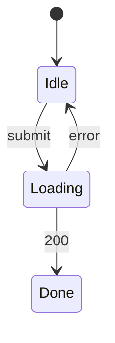

# Meeting room booking — UI spec

## Screens
| Screen | Route | Components | Mock | REQ |
|---|---|---|---|---|
| RoomBookingPage | /booking | CMP-001, CMP-002 | specs/in-progress/room-booking/mock/booking.html | REQ-001, REQ-002, REQ-003 |

## UI States
### STM-UI-001 RoomBookingPage (REQ-001)

## Field Validation
| Screen | Field | Rule | Error Message | AC Refs |
|---|---|---|---|---|
| RoomBookingPage | BookRoom | the time slot overlaps another booking | the response is 409 SLOT_TAKEN | AC-001-2 |
