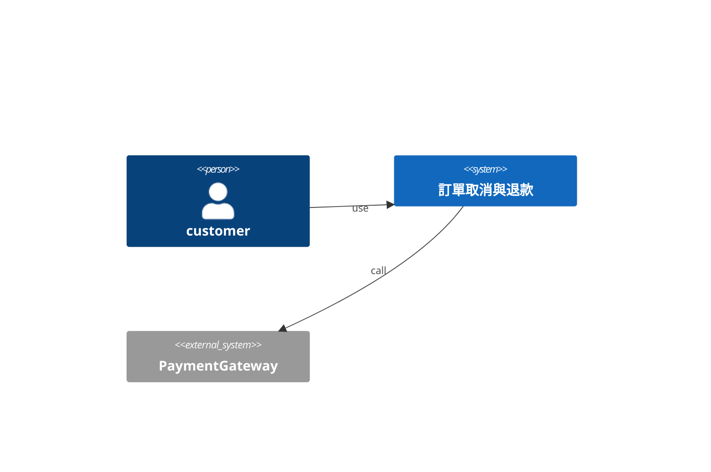
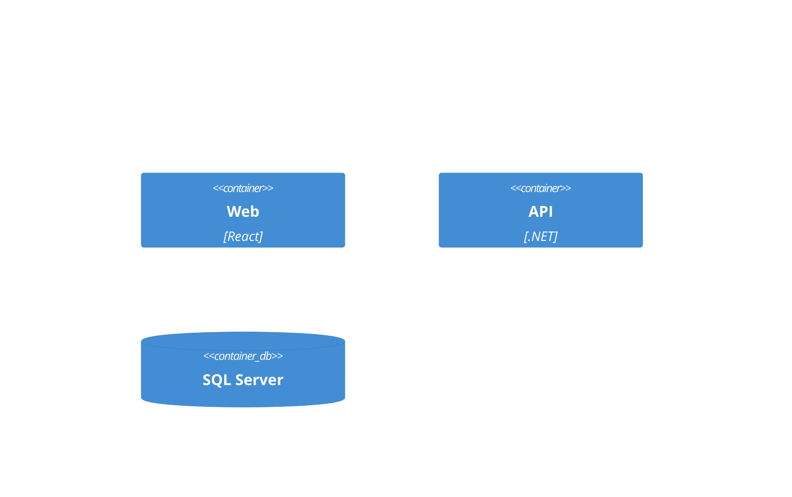
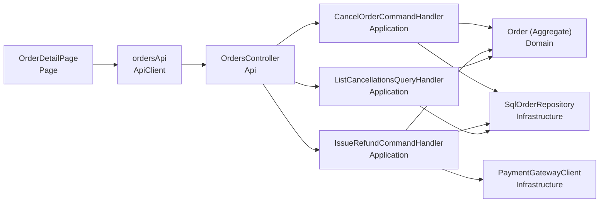
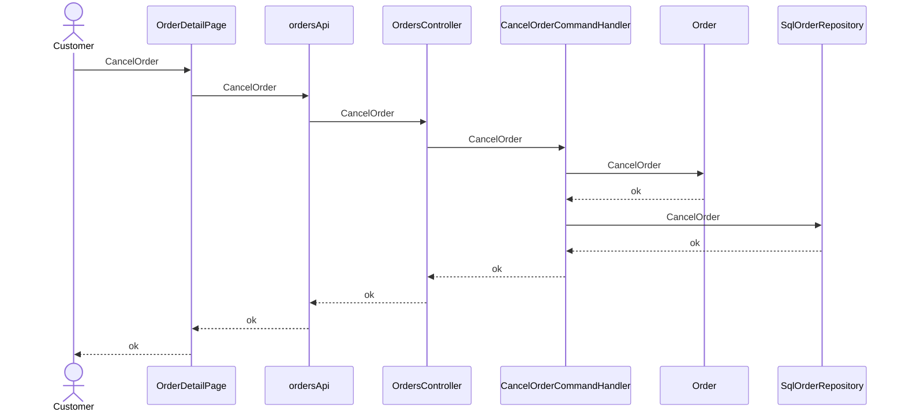
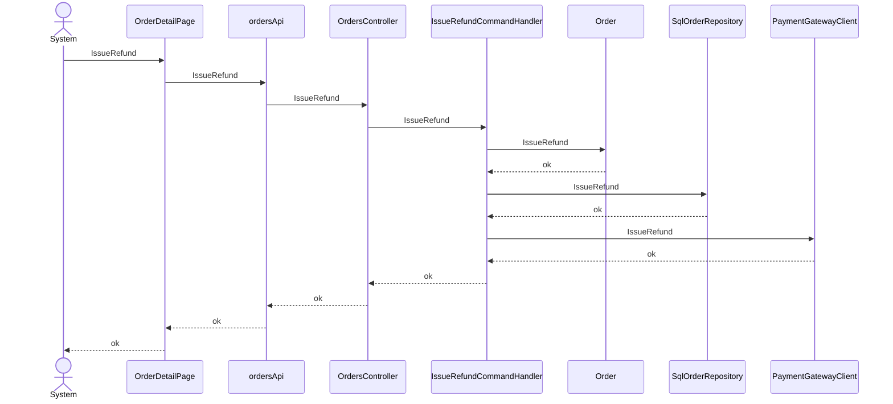
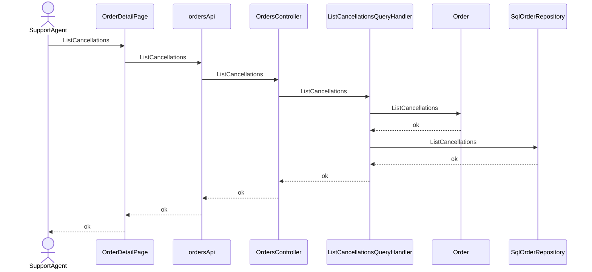

# 訂單取消與退款 — architecture (C4)

## Context(L1)
### C4-L1

## Container(L2)
### C4-L2

## Component(L3)
| ID | 名稱 | Layer | Context | depends | external | 技術 |
|---|---|---|---|---|---|---|
| CMP-001 | OrderDetailPage | Page | Orders | CMP-002 |  | React |
| CMP-002 | ordersApi | ApiClient | Orders | CMP-003 |  |  |
| CMP-003 | OrdersController | Api | Orders | CMP-004, CMP-005, CMP-006 |  | ASP.NET Core |
| CMP-004 | CancelOrderCommandHandler | Application | Orders | CMP-007, CMP-008 |  | MediatR |
| CMP-005 | IssueRefundCommandHandler | Application | Orders | CMP-007, CMP-008, CMP-009 |  | MediatR |
| CMP-006 | ListCancellationsQueryHandler | Application | Orders | CMP-007, CMP-008 |  | MediatR |
| CMP-007 | Order (Aggregate) | Domain | Orders |  |  |  |
| CMP-008 | SqlOrderRepository : IOrderRepository | Infrastructure | Orders |  |  | EF Core |
| CMP-009 | PaymentGatewayClient : IPaymentGateway | Infrastructure | Orders |  | PaymentGateway |  |

### C4-L3

## 追溯(AC → 技術元件)
| AC | CMP | via | 職責 |
|---|---|---|---|
| AC-001-1 | CMP-001 | SEQ-001 | 顯示並觸發cancel |
| AC-001-1 | CMP-002 | SEQ-001 | 呼叫cancel API |
| AC-001-1 | CMP-003 | SEQ-001 | 接收cancel請求 |
| AC-001-1 | CMP-004 | SEQ-001 | 編排cancel |
| AC-001-1 | CMP-007 | SEQ-001 | cancel的業務規則與不變量 |
| AC-001-1 | CMP-008 | SEQ-001 | 持久化cancel結果 |
| AC-001-2 | CMP-001 | SEQ-001 | 顯示並觸發cancel |
| AC-001-2 | CMP-002 | SEQ-001 | 呼叫cancel API |
| AC-001-2 | CMP-003 | SEQ-001 | 接收cancel請求 |
| AC-001-2 | CMP-004 | SEQ-001 | 編排cancel |
| AC-001-2 | CMP-007 | SEQ-001 | cancel的業務規則與不變量 |
| AC-001-2 | CMP-008 | SEQ-001 | 持久化cancel結果 |
| AC-002-1 | CMP-001 | SEQ-002 | 顯示並觸發refund |
| AC-002-1 | CMP-002 | SEQ-002 | 呼叫refund API |
| AC-002-1 | CMP-003 | SEQ-002 | 接收refund請求 |
| AC-002-1 | CMP-005 | SEQ-002 | 編排refund |
| AC-002-1 | CMP-007 | SEQ-002 | refund的業務規則與不變量 |
| AC-002-1 | CMP-008 | SEQ-002 | 持久化refund結果 |
| AC-002-1 | CMP-009 | SEQ-002 | 為refund呼叫外部系統 |
| AC-002-2 | CMP-001 | SEQ-002 | 顯示並觸發refund |
| AC-002-2 | CMP-002 | SEQ-002 | 呼叫refund API |
| AC-002-2 | CMP-003 | SEQ-002 | 接收refund請求 |
| AC-002-2 | CMP-005 | SEQ-002 | 編排refund |
| AC-002-2 | CMP-007 | SEQ-002 | refund的業務規則與不變量 |
| AC-002-2 | CMP-008 | SEQ-002 | 持久化refund結果 |
| AC-002-2 | CMP-009 | SEQ-002 | 為refund呼叫外部系統 |
| AC-003-1 | CMP-001 | SEQ-003 | 顯示並觸發view |
| AC-003-1 | CMP-002 | SEQ-003 | 呼叫view API |
| AC-003-1 | CMP-003 | SEQ-003 | 接收view請求 |
| AC-003-1 | CMP-006 | SEQ-003 | 編排view |
| AC-003-1 | CMP-007 | SEQ-003 | view的業務規則與不變量 |
| AC-003-1 | CMP-008 | SEQ-003 | 持久化view結果 |
| AC-N01-1 | CMP-003 | API-002 | NFR P95 < 5 min |

## Sequence
### SEQ-001 (UC-001 / REQ-001)

### SEQ-002 (UC-002 / REQ-002)

### SEQ-003 (UC-003 / REQ-003)

