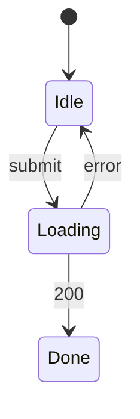

# 訂單取消與退款 — UI spec

## 畫面清單
| 畫面 | 路由 | 元件 | Mock | 對應 REQ |
|---|---|---|---|---|
| OrderDetailPage | /order | CMP-001, CMP-002 | specs/in-progress/order-cancel/mock/order.html | REQ-001, REQ-002, REQ-003 |

## 介面狀態
### STM-UI-001 OrderDetailPage (REQ-001)

## 欄位驗證
| 畫面 | 欄位 | 規則 | 錯誤訊息 | 對應 AC |
|---|---|---|---|---|
| OrderDetailPage | CancelOrder | Order 狀態為 Shipped | 回應 409 ORDER_SHIPPED,狀態不變 | AC-001-2 |
