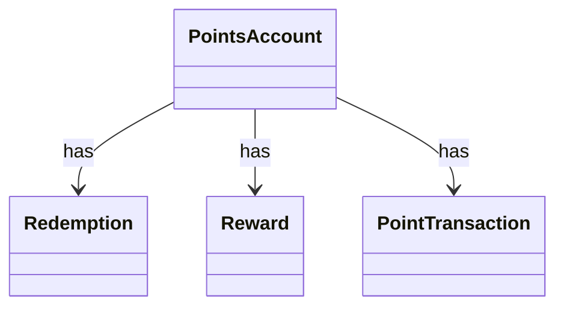

# SA2 Entities / Relations

## Entities
| Entity | Symbol | Attributes | Source Words |
|---|---|---|---|
| points account | PointsAccount | Id | points account |
| redemption | Redemption | Id, Status | redemption |
| reward | Reward | Id | reward |
| points transaction | PointTransaction | Id | points transaction |

## Relations
| Source | Relation | Target | Multiplicity |
|---|---|---|---|
| PointsAccount | has | Redemption | 1..* |
| PointsAccount | has | Reward | 1..* |
| PointsAccount | has | PointTransaction | 1..* |

### CLS-SA-001 (REQ-001)

