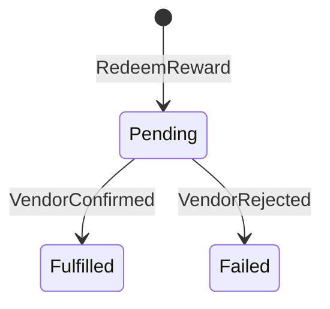
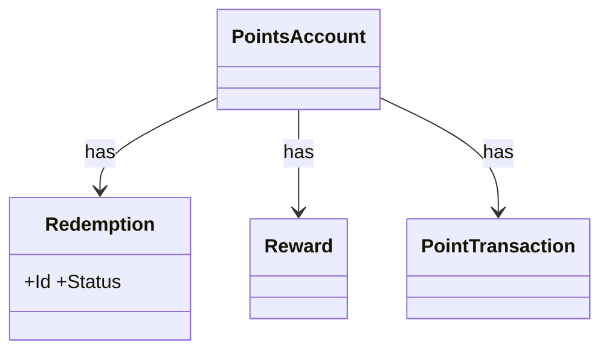

# Loyalty points redemption — domain model

## Use Cases
### UC-001 A member can redeem a reward when the points account has enough points (REQ-001)
- Primary actor: member
- Trigger: the member redeems it
- Precondition: the balance covers the reward
- Postcondition (success guarantee): a redemption is created and the reward vendor is called
- Main flow:
  1. the member redeems it
  2. a redemption is created and the reward vendor is called
- Alternative flow: none
- Exception flow: the response is 422 INSUFFICIENT_POINTS and nothing is deducted

### UC-002 Points expire after 12 months (REQ-002)
- Primary actor: system
- Trigger: the monthly job runs
- Precondition: points were earned 13 months ago
- Postcondition (success guarantee): an expiry points transaction is written and the balance drops
- Main flow:
  1. the monthly job runs
  2. an expiry points transaction is written and the balance drops
- Alternative flow: none
- Exception flow: none

### UC-003 A member can view each points transaction (REQ-003)
- Primary actor: member
- Trigger: the member opens the history
- Precondition: the member has a points transaction
- Postcondition (success guarantee): each points transaction shows date, type and points
- Main flow:
  1. the member opens the history
  2. each points transaction shows date, type and points
- Alternative flow: none
- Exception flow: none

## State Machines
### STM-DOM-001 Redemption.Status (REQ-001)

## Domain Model
| Type | Name | Invariant |
|---|---|---|
| Aggregate Root | Redemption | Status: Pending → Fulfilled → Failed |
| Entity | PointsAccount | — |
| Entity | Reward | — |
| Entity | PointTransaction | — |

### CLS-001 Redemption (REQ-001)

