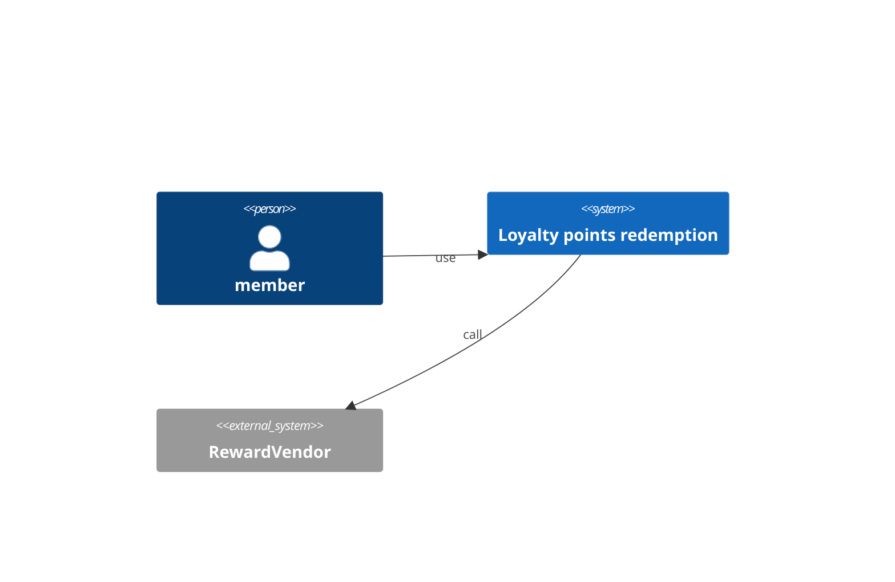
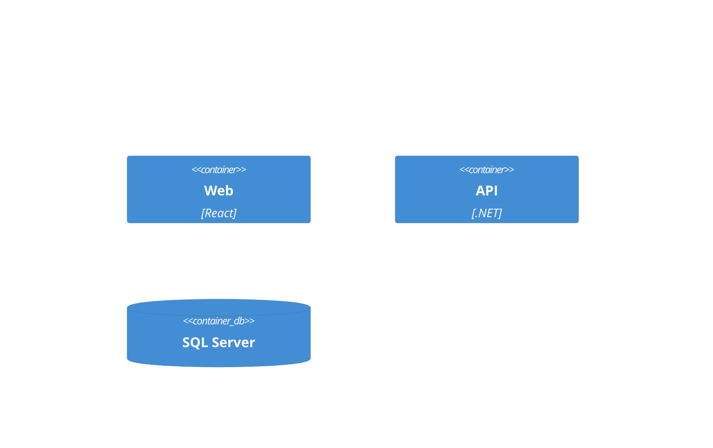
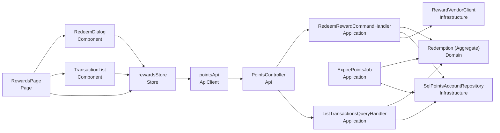
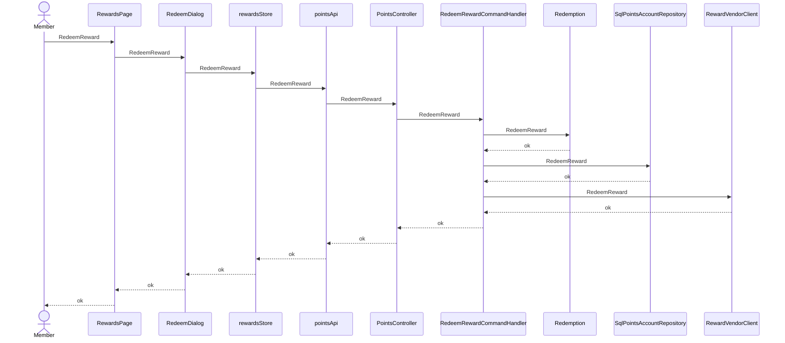
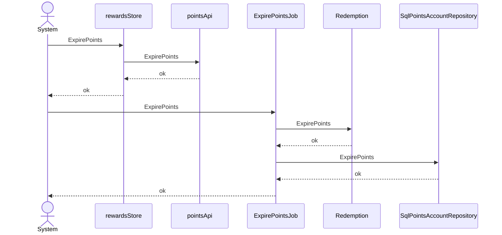
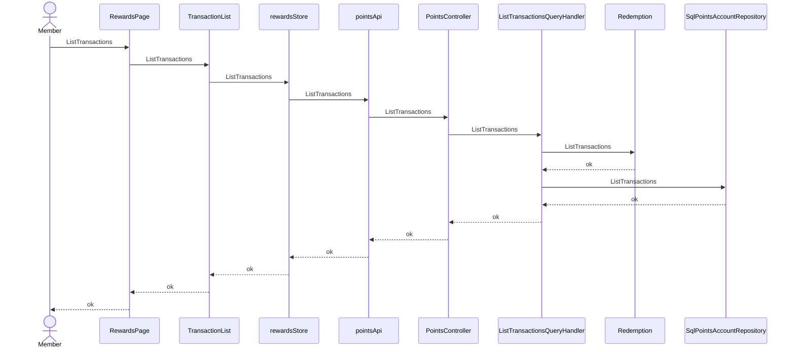

# Loyalty points redemption — architecture (C4)

## Context (L1)
### C4-L1

## Container (L2)
### C4-L2

## Component (L3)
| ID | Name | Layer | Context | depends | external | Tech |
|---|---|---|---|---|---|---|
| CMP-001 | RewardsPage | Page | Loyalty | CMP-002, CMP-003, CMP-004 |  | React |
| CMP-002 | RedeemDialog | Component | Loyalty | CMP-004 |  | React |
| CMP-003 | TransactionList | Component | Loyalty | CMP-004 |  | React |
| CMP-004 | rewardsStore | Store | Loyalty | CMP-005 |  | Zustand |
| CMP-005 | pointsApi | ApiClient | Loyalty | CMP-006 |  |  |
| CMP-006 | PointsController | Api | Loyalty | CMP-007, CMP-009 |  | ASP.NET Core |
| CMP-007 | RedeemRewardCommandHandler | Application | Loyalty | CMP-010, CMP-011, CMP-012 |  | MediatR |
| CMP-008 | ExpirePointsJob | Application | Loyalty | CMP-010, CMP-011 |  | ASP.NET Core |
| CMP-009 | ListTransactionsQueryHandler | Application | Loyalty | CMP-010, CMP-011 |  | MediatR |
| CMP-010 | Redemption (Aggregate) | Domain | Loyalty |  |  |  |
| CMP-011 | SqlPointsAccountRepository : IPointsAccountRepository | Infrastructure | Loyalty |  |  | EF Core |
| CMP-012 | RewardVendorClient : IRewardVendor | Infrastructure | Loyalty |  | RewardVendor |  |

### C4-L3

## Traceability
| AC | CMP | via | Responsibility |
|---|---|---|---|
| AC-001-1 | CMP-001 | SEQ-001 | render and trigger redeem |
| AC-001-1 | CMP-002 | SEQ-001 | UI guard for redeem |
| AC-001-1 | CMP-004 | SEQ-001 | client state transition for redeem |
| AC-001-1 | CMP-005 | SEQ-001 | call the API for redeem |
| AC-001-1 | CMP-006 | SEQ-001 | receive the redeem request |
| AC-001-1 | CMP-007 | SEQ-001 | orchestrate redeem |
| AC-001-1 | CMP-010 | SEQ-001 | enforce the redeem invariant |
| AC-001-1 | CMP-011 | SEQ-001 | persist the redeem result |
| AC-001-1 | CMP-012 | SEQ-001 | call the external system for redeem |
| AC-001-2 | CMP-001 | SEQ-001 | render and trigger redeem |
| AC-001-2 | CMP-002 | SEQ-001 | UI guard for redeem |
| AC-001-2 | CMP-004 | SEQ-001 | client state transition for redeem |
| AC-001-2 | CMP-005 | SEQ-001 | call the API for redeem |
| AC-001-2 | CMP-006 | SEQ-001 | receive the redeem request |
| AC-001-2 | CMP-007 | SEQ-001 | orchestrate redeem |
| AC-001-2 | CMP-010 | SEQ-001 | enforce the redeem invariant |
| AC-001-2 | CMP-011 | SEQ-001 | persist the redeem result |
| AC-001-2 | CMP-012 | SEQ-001 | call the external system for redeem |
| AC-002-1 | CMP-004 | SEQ-002 | client state transition for expire |
| AC-002-1 | CMP-005 | SEQ-002 | call the API for expire |
| AC-002-1 | CMP-008 | SEQ-002 | orchestrate expire |
| AC-002-1 | CMP-010 | SEQ-002 | enforce the expire invariant |
| AC-002-1 | CMP-011 | SEQ-002 | persist the expire result |
| AC-003-1 | CMP-001 | SEQ-003 | render and trigger view |
| AC-003-1 | CMP-003 | SEQ-003 | UI guard for view |
| AC-003-1 | CMP-004 | SEQ-003 | client state transition for view |
| AC-003-1 | CMP-005 | SEQ-003 | call the API for view |
| AC-003-1 | CMP-006 | SEQ-003 | receive the view request |
| AC-003-1 | CMP-009 | SEQ-003 | orchestrate view |
| AC-003-1 | CMP-010 | SEQ-003 | enforce the view invariant |
| AC-003-1 | CMP-011 | SEQ-003 | persist the view result |
| AC-N01-1 | CMP-006 | API-001 | NFR balance never negative |

## Sequence
### SEQ-001 (UC-001 / REQ-001)

### SEQ-002 (UC-002 / REQ-002)

### SEQ-003 (UC-003 / REQ-003)

