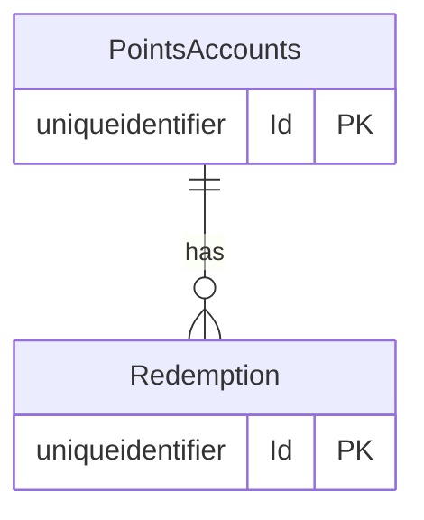

# Loyalty points redemption — data model

## Tables
### ERD-001

## Ownership
| Table | Owner Context | Access From Other Contexts |
|---|---|---|
| PointsAccounts | Loyalty | — |
| Redemption | Loyalty | — |
