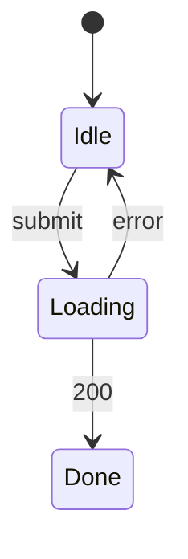

# Loyalty points redemption — UI spec

## Screens
| Screen | Route | Components | Mock | REQ |
|---|---|---|---|---|
| RewardsPage | /rewards | CMP-001, CMP-002, CMP-003, CMP-004, CMP-005 | specs/in-progress/points-redemption/mock/rewards.html | REQ-001, REQ-003 |

## UI States
### STM-UI-001 RewardsPage (REQ-001)

## Field Validation
| Screen | Field | Rule | Error Message | AC Refs |
|---|---|---|---|---|
| RewardsPage | RedeemReward | the balance is not enough | the response is 422 INSUFFICIENT_POINTS and nothing is deducted | AC-001-2 |
