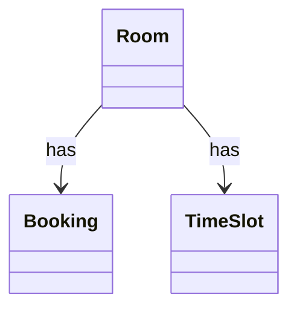

# SA2 實體 / 關係

## 實體
| 實體 | 英文 | 屬性 | 來源詞 |
|---|---|---|---|
| 會議室 | Room | Id | Room |
| 預約單 | Booking | Id, Status | Booking |
| 時段 | TimeSlot | Id | TimeSlot |

## 關係
| 來源 | 關係 | 目標 | 多重性 |
|---|---|---|---|
| Room | has | Booking | 1..* |
| Room | has | TimeSlot | 1..* |

### CLS-SA-001 (REQ-001)

