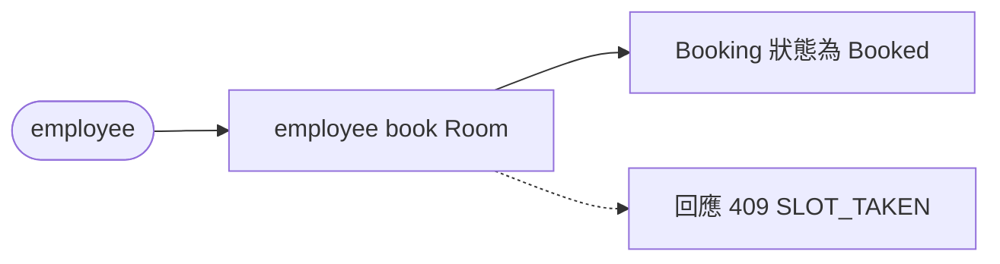
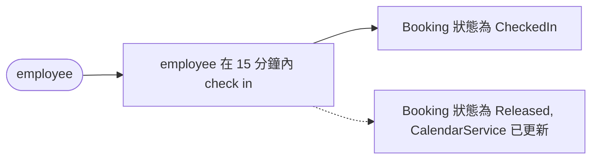
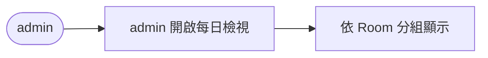
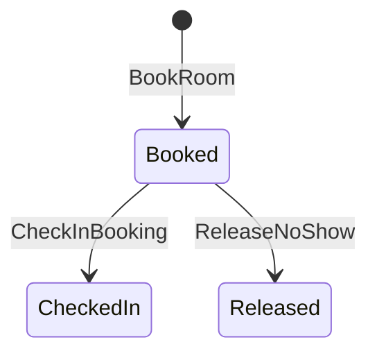
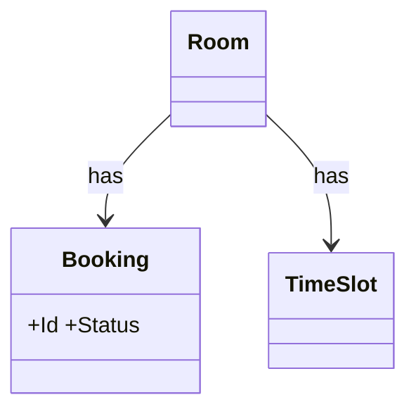

# 會議室預約 — domain model

## Use Case
### UC-001 employee 可 book Room, TimeSlot 不得重疊 (REQ-001)
- 主要參與者: employee
- 觸發: employee book Room
- 前置條件: TimeSlot 空閒
- 後置條件(成功保證): Booking 狀態為 Booked
- 主流程:
  1. employee book Room
  2. Booking 狀態為 Booked
- 替代流程: 無
- 例外流程: 回應 409 SLOT_TAKEN

### UC-002 15 分鐘內 check in,否則 system release Room (REQ-002)
- 主要參與者: employee
- 觸發: employee 在 15 分鐘內 check in
- 前置條件: Booking 狀態為 Booked
- 後置條件(成功保證): Booking 狀態為 CheckedIn
- 主流程:
  1. employee 在 15 分鐘內 check in
  2. Booking 狀態為 CheckedIn
- 替代流程: 無
- 例外流程: Booking 狀態為 Released, CalendarService 已更新

### UC-003 admin 可 view 每日 Booking (REQ-003)
- 主要參與者: admin
- 觸發: admin 開啟每日檢視
- 前置條件: 今天有 Booking
- 後置條件(成功保證): 依 Room 分組顯示
- 主流程:
  1. admin 開啟每日檢視
  2. 依 Room 分組顯示
- 替代流程: 無
- 例外流程: 無

## 狀態機
### STM-DOM-001 Booking.Status (REQ-001, REQ-002)

## 領域模型
| 類型 | 名稱 | 不變量 |
|---|---|---|
| Aggregate Root | Booking | Status: Booked → CheckedIn → Released |
| Entity | Room | — |
| Entity | TimeSlot | — |

### CLS-001 Booking (REQ-001)

