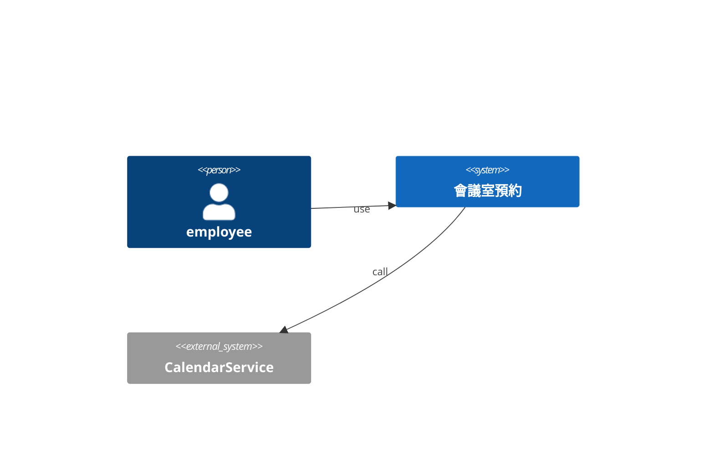
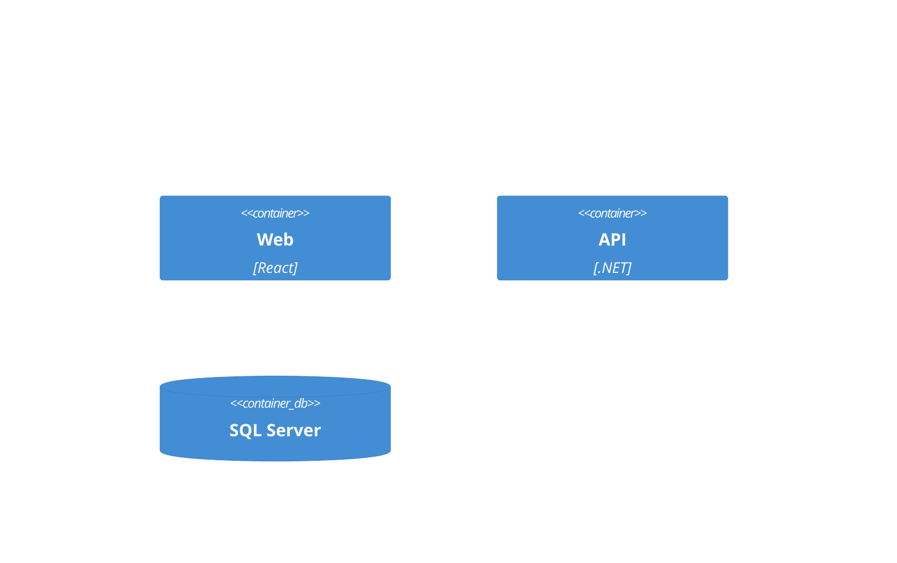
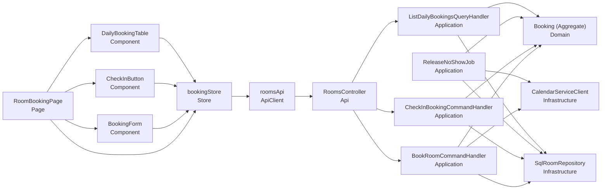
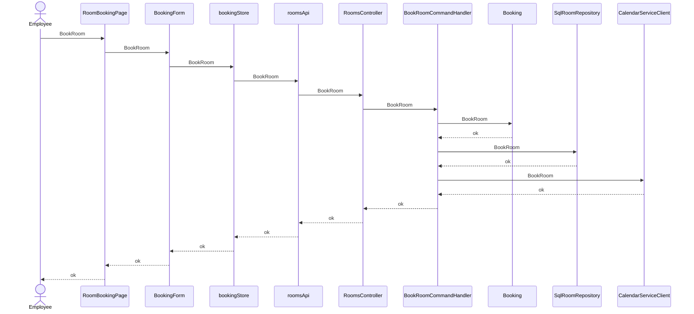
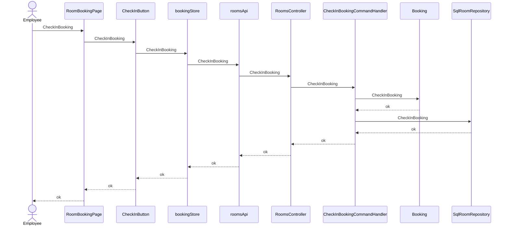
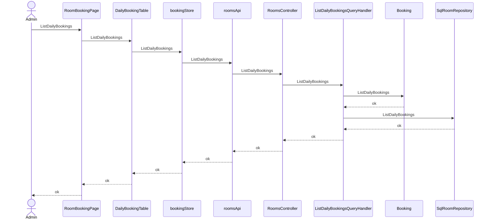

# 會議室預約 — architecture (C4)

## Context(L1)
### C4-L1

## Container(L2)
### C4-L2

## Component(L3)
| ID | 名稱 | Layer | Context | depends | external | 技術 |
|---|---|---|---|---|---|---|
| CMP-001 | RoomBookingPage | Page | Rooms | CMP-002, CMP-003, CMP-004, CMP-005 |  | React |
| CMP-002 | BookingForm | Component | Rooms | CMP-005 |  | React |
| CMP-003 | CheckInButton | Component | Rooms | CMP-005 |  | React |
| CMP-004 | DailyBookingTable | Component | Rooms | CMP-005 |  | React |
| CMP-005 | bookingStore | Store | Rooms | CMP-006 |  | Zustand |
| CMP-006 | roomsApi | ApiClient | Rooms | CMP-007 |  |  |
| CMP-007 | RoomsController | Api | Rooms | CMP-008, CMP-009, CMP-011 |  | ASP.NET Core |
| CMP-008 | BookRoomCommandHandler | Application | Rooms | CMP-012, CMP-013, CMP-014 |  | MediatR |
| CMP-009 | CheckInBookingCommandHandler | Application | Rooms | CMP-012, CMP-013 |  | MediatR |
| CMP-010 | ReleaseNoShowJob | Application | Rooms | CMP-012, CMP-013, CMP-014 |  | ASP.NET Core |
| CMP-011 | ListDailyBookingsQueryHandler | Application | Rooms | CMP-012, CMP-013 |  | MediatR |
| CMP-012 | Booking (Aggregate) | Domain | Rooms |  |  |  |
| CMP-013 | SqlRoomRepository : IRoomRepository | Infrastructure | Rooms |  |  | EF Core |
| CMP-014 | CalendarServiceClient : ICalendarService | Infrastructure | Rooms |  | CalendarService |  |

### C4-L3

## 追溯(AC → 技術元件)
| AC | CMP | via | 職責 |
|---|---|---|---|
| AC-001-1 | CMP-001 | SEQ-001 | 顯示並觸發book |
| AC-001-1 | CMP-002 | SEQ-001 | book的 UI 守衛 |
| AC-001-1 | CMP-005 | SEQ-001 | book的前端狀態轉移 |
| AC-001-1 | CMP-006 | SEQ-001 | 呼叫book API |
| AC-001-1 | CMP-007 | SEQ-001 | 接收book請求 |
| AC-001-1 | CMP-008 | SEQ-001 | 編排book |
| AC-001-1 | CMP-012 | SEQ-001 | book的業務規則與不變量 |
| AC-001-1 | CMP-013 | SEQ-001 | 持久化book結果 |
| AC-001-1 | CMP-014 | SEQ-001 | 為book呼叫外部系統 |
| AC-001-2 | CMP-001 | SEQ-001 | 顯示並觸發book |
| AC-001-2 | CMP-002 | SEQ-001 | book的 UI 守衛 |
| AC-001-2 | CMP-005 | SEQ-001 | book的前端狀態轉移 |
| AC-001-2 | CMP-006 | SEQ-001 | 呼叫book API |
| AC-001-2 | CMP-007 | SEQ-001 | 接收book請求 |
| AC-001-2 | CMP-008 | SEQ-001 | 編排book |
| AC-001-2 | CMP-012 | SEQ-001 | book的業務規則與不變量 |
| AC-001-2 | CMP-013 | SEQ-001 | 持久化book結果 |
| AC-001-2 | CMP-014 | SEQ-001 | 為book呼叫外部系統 |
| AC-002-1 | CMP-001 | SEQ-002 | 顯示並觸發check in |
| AC-002-1 | CMP-003 | SEQ-002 | check in的 UI 守衛 |
| AC-002-1 | CMP-005 | SEQ-002 | check in的前端狀態轉移 |
| AC-002-1 | CMP-006 | SEQ-002 | 呼叫check in API |
| AC-002-1 | CMP-007 | SEQ-002 | 接收check in請求 |
| AC-002-1 | CMP-009 | SEQ-002 | 編排check in |
| AC-002-1 | CMP-012 | SEQ-002 | check in的業務規則與不變量 |
| AC-002-1 | CMP-013 | SEQ-002 | 持久化check in結果 |
| AC-002-1 | CMP-010 | SEQ-002 | 編排release |
| AC-002-1 | CMP-014 | SEQ-002 | 為release呼叫外部系統 |
| AC-002-2 | CMP-001 | SEQ-002 | 顯示並觸發check in |
| AC-002-2 | CMP-003 | SEQ-002 | check in的 UI 守衛 |
| AC-002-2 | CMP-005 | SEQ-002 | check in的前端狀態轉移 |
| AC-002-2 | CMP-006 | SEQ-002 | 呼叫check in API |
| AC-002-2 | CMP-007 | SEQ-002 | 接收check in請求 |
| AC-002-2 | CMP-009 | SEQ-002 | 編排check in |
| AC-002-2 | CMP-012 | SEQ-002 | check in的業務規則與不變量 |
| AC-002-2 | CMP-013 | SEQ-002 | 持久化check in結果 |
| AC-002-2 | CMP-010 | SEQ-002 | 編排release |
| AC-002-2 | CMP-014 | SEQ-002 | 為release呼叫外部系統 |
| AC-003-1 | CMP-001 | SEQ-003 | 顯示並觸發view |
| AC-003-1 | CMP-004 | SEQ-003 | view的 UI 守衛 |
| AC-003-1 | CMP-005 | SEQ-003 | view的前端狀態轉移 |
| AC-003-1 | CMP-006 | SEQ-003 | 呼叫view API |
| AC-003-1 | CMP-007 | SEQ-003 | 接收view請求 |
| AC-003-1 | CMP-011 | SEQ-003 | 編排view |
| AC-003-1 | CMP-012 | SEQ-003 | view的業務規則與不變量 |
| AC-003-1 | CMP-013 | SEQ-003 | 持久化view結果 |
| AC-N01-1 | CMP-007 | API-001 | NFR 100 concurrent → 1 success |

## Sequence
### SEQ-001 (UC-001 / REQ-001)

### SEQ-002 (UC-002 / REQ-002)

### SEQ-003 (UC-003 / REQ-003)

