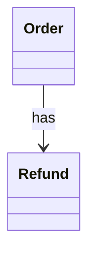

# SA2 實體 / 關係

## 實體
| 實體 | 英文 | 屬性 | 來源詞 |
|---|---|---|---|
| 訂單 | Order | Id, Status | 訂單 |
| 退款單 | Refund | Id | 退款單 |

## 關係
| 來源 | 關係 | 目標 | 多重性 |
|---|---|---|---|
| Order | has | Refund | 1..* |

### CLS-SA-001 (REQ-001)

