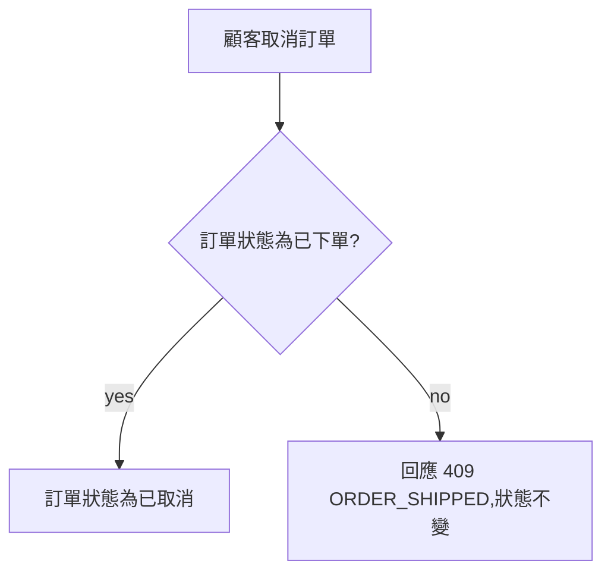
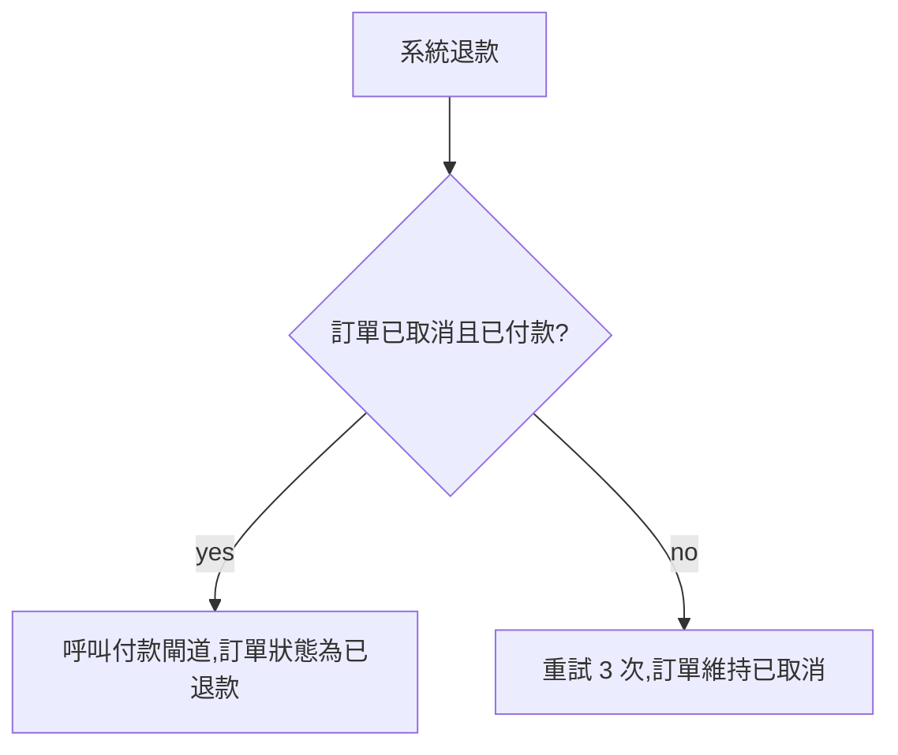
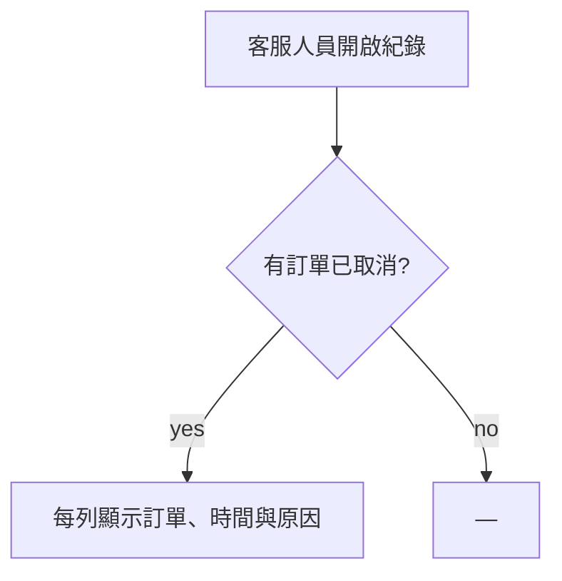

# SA5 Activity Diagram

## Activity Diagram
### ACT-001 (REQ-001)

```mermaid
flowchart TD
  A["顧客取消訂單"] --> B{"訂單狀態為已下單?"}
  B -->|yes| C["訂單狀態為已取消"]
  B -->|no| D["回應 409 ORDER_SHIPPED,狀態不變"]
```

### ACT-002 (REQ-002)

```mermaid
flowchart TD
  A["系統退款"] --> B{"訂單已取消且已付款?"}
  B -->|yes| C["呼叫付款閘道,訂單狀態為已退款"]
  B -->|no| D["重試 3 次,訂單維持已取消"]
```

### ACT-003 (REQ-003)

```mermaid
flowchart TD
  A["客服人員開啟紀錄"] --> B{"有訂單已取消?"}
  B -->|yes| C["每列顯示訂單、時間與原因"]
  B -->|no| E["—"]
```

