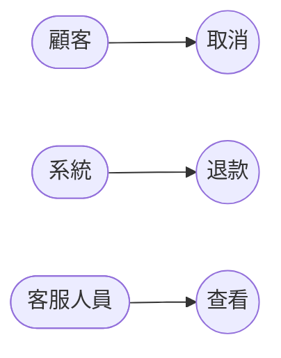

# SA4 Use Case Diagram

## Use Case Diagram
### UCD-001 (REQ-001)

```mermaid
flowchart LR
  customer(["顧客"]) --> cancel(("取消"))
  system(["系統"]) --> issue_refund(("退款"))
  support_agent(["客服人員"]) --> view_history(("查看"))
```
