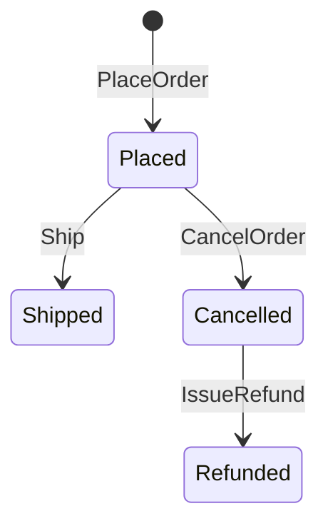
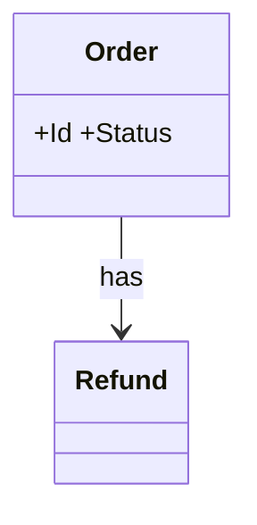

# 訂單取消與退款 — domain model

## Use Case
### UC-001 顧客可在出貨前取消訂單 (REQ-001)
- 主要參與者: 顧客
- 觸發: 顧客取消訂單
- 前置條件: 訂單狀態為已下單
- 後置條件(成功保證): 訂單狀態為已取消
- 主流程:
  1. 顧客取消訂單
  2. 訂單狀態為已取消
- 替代流程: 無
- 例外流程: 回應 409 ORDER_SHIPPED,狀態不變

### UC-002 取消後系統經付款閘道退款 (REQ-002)
- 主要參與者: 系統
- 觸發: 系統退款
- 前置條件: 訂單已取消且已付款
- 後置條件(成功保證): 呼叫付款閘道,訂單狀態為已退款
- 主流程:
  1. 系統退款
  2. 呼叫付款閘道,訂單狀態為已退款
- 替代流程: 無
- 例外流程: 重試 3 次,訂單維持已取消

### UC-003 客服人員可查看取消紀錄 (REQ-003)
- 主要參與者: 客服人員
- 觸發: 客服人員開啟紀錄
- 前置條件: 有訂單已取消
- 後置條件(成功保證): 每列顯示訂單、時間與原因
- 主流程:
  1. 客服人員開啟紀錄
  2. 每列顯示訂單、時間與原因
- 替代流程: 無
- 例外流程: 無

## 狀態機
### STM-DOM-001 Order.Status (REQ-001)

## 領域模型
| 類型 | 名稱 | 不變量 |
|---|---|---|
| Aggregate Root | Order | Status: Placed → Shipped → Cancelled → Refunded |
| Entity | Refund | — |

### CLS-001 Order (REQ-001)

