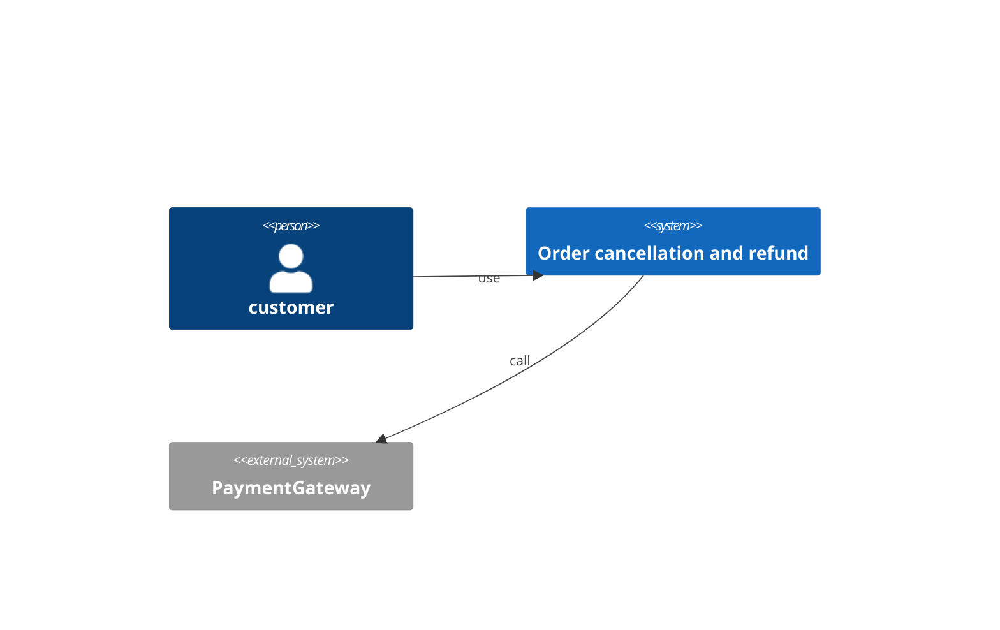
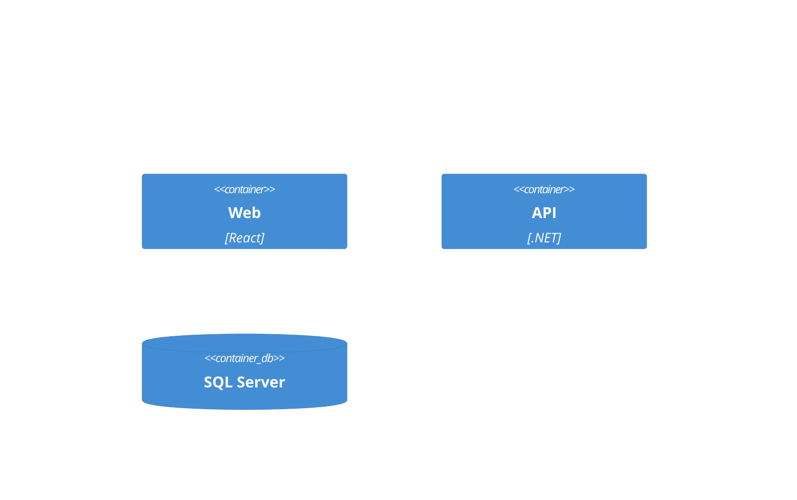
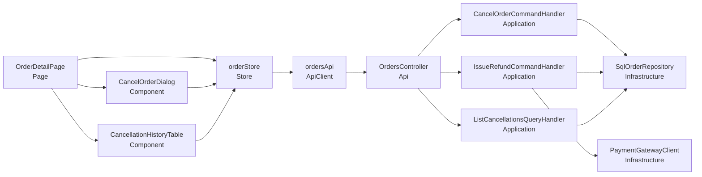
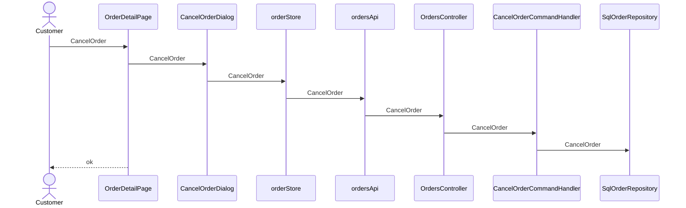
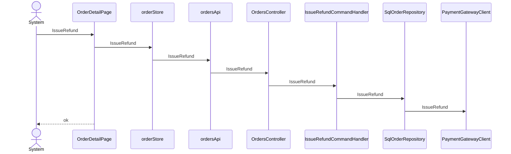
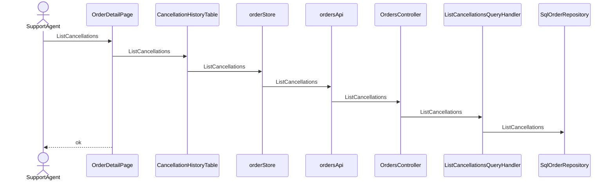

# Order cancellation and refund — architecture (C4)

## Context (L1)
### C4-L1

## Container (L2)
### C4-L2

## Component (L3)
| ID | Name | Layer | Context | depends | external | Tech |
|---|---|---|---|---|---|---|
| CMP-001 | OrderDetailPage | Page | Orders | CMP-002, CMP-003, CMP-004 |  | React |
| CMP-002 | CancelOrderDialog | Component | Orders | CMP-004 |  | React |
| CMP-003 | CancellationHistoryTable | Component | Orders | CMP-004 |  | React |
| CMP-004 | orderStore | Store | Orders | CMP-005 |  | Zustand |
| CMP-005 | ordersApi | ApiClient | Orders | CMP-006 |  |  |
| CMP-006 | OrdersController | Api | Orders | CMP-007, CMP-008, CMP-009 |  | ASP.NET Core |
| CMP-007 | CancelOrderCommandHandler | Application | Orders | CMP-010 |  | MediatR |
| CMP-008 | IssueRefundCommandHandler | Application | Orders | CMP-010, CMP-011 |  | MediatR |
| CMP-009 | ListCancellationsQueryHandler | Application | Orders | CMP-010 |  | MediatR |
| CMP-010 | SqlOrderRepository : IOrderRepository | Infrastructure | Orders |  |  | EF Core |
| CMP-011 | PaymentGatewayClient : IPaymentGateway | Infrastructure | Orders |  | PaymentGateway |  |

### C4-L3

## Traceability
| AC | CMP | via | Responsibility |
|---|---|---|---|
| AC-001-1 | CMP-001 | SEQ-001 | render and trigger cancel |
| AC-001-1 | CMP-002 | SEQ-001 | UI guard for cancel |
| AC-001-1 | CMP-004 | SEQ-001 | client state transition for cancel |
| AC-001-1 | CMP-005 | SEQ-001 | call the API for cancel |
| AC-001-1 | CMP-006 | SEQ-001 | receive the cancel request |
| AC-001-1 | CMP-007 | SEQ-001 | orchestrate cancel |
| AC-001-1 | CMP-010 | SEQ-001 | persist the cancel result |
| AC-001-2 | CMP-001 | SEQ-001 | render and trigger cancel |
| AC-001-2 | CMP-002 | SEQ-001 | UI guard for cancel |
| AC-001-2 | CMP-004 | SEQ-001 | client state transition for cancel |
| AC-001-2 | CMP-005 | SEQ-001 | call the API for cancel |
| AC-001-2 | CMP-006 | SEQ-001 | receive the cancel request |
| AC-001-2 | CMP-007 | SEQ-001 | orchestrate cancel |
| AC-001-2 | CMP-010 | SEQ-001 | persist the cancel result |
| AC-002-1 | CMP-001 | SEQ-002 | render and trigger refund |
| AC-002-1 | CMP-004 | SEQ-002 | client state transition for refund |
| AC-002-1 | CMP-005 | SEQ-002 | call the API for refund |
| AC-002-1 | CMP-006 | SEQ-002 | receive the refund request |
| AC-002-1 | CMP-008 | SEQ-002 | orchestrate refund |
| AC-002-1 | CMP-010 | SEQ-002 | persist the refund result |
| AC-002-1 | CMP-011 | SEQ-002 | call the external system for refund |
| AC-002-2 | CMP-001 | SEQ-002 | render and trigger refund |
| AC-002-2 | CMP-004 | SEQ-002 | client state transition for refund |
| AC-002-2 | CMP-005 | SEQ-002 | call the API for refund |
| AC-002-2 | CMP-006 | SEQ-002 | receive the refund request |
| AC-002-2 | CMP-008 | SEQ-002 | orchestrate refund |
| AC-002-2 | CMP-010 | SEQ-002 | persist the refund result |
| AC-002-2 | CMP-011 | SEQ-002 | call the external system for refund |
| AC-003-1 | CMP-001 | SEQ-003 | render and trigger view |
| AC-003-1 | CMP-003 | SEQ-003 | UI guard for view |
| AC-003-1 | CMP-004 | SEQ-003 | client state transition for view |
| AC-003-1 | CMP-005 | SEQ-003 | call the API for view |
| AC-003-1 | CMP-006 | SEQ-003 | receive the view request |
| AC-003-1 | CMP-009 | SEQ-003 | orchestrate view |
| AC-003-1 | CMP-010 | SEQ-003 | persist the view result |
| AC-N01-1 | CMP-006 | API-002 | NFR P95 < 5 min |

## Sequence
### SEQ-001 (UC-001 / REQ-001)

### SEQ-002 (UC-002 / REQ-002)

### SEQ-003 (UC-003 / REQ-003)

