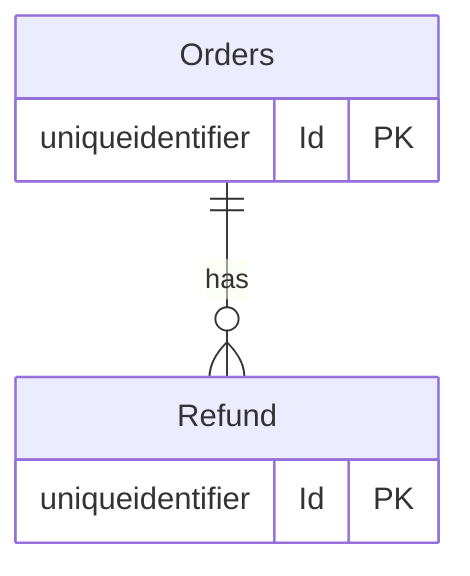

# Order cancellation and refund — data model

## Tables
### ERD-001

## Ownership
| Table | Owner Context | Access From Other Contexts |
|---|---|---|
| Orders | Orders | — |
| Refund | Orders | — |
