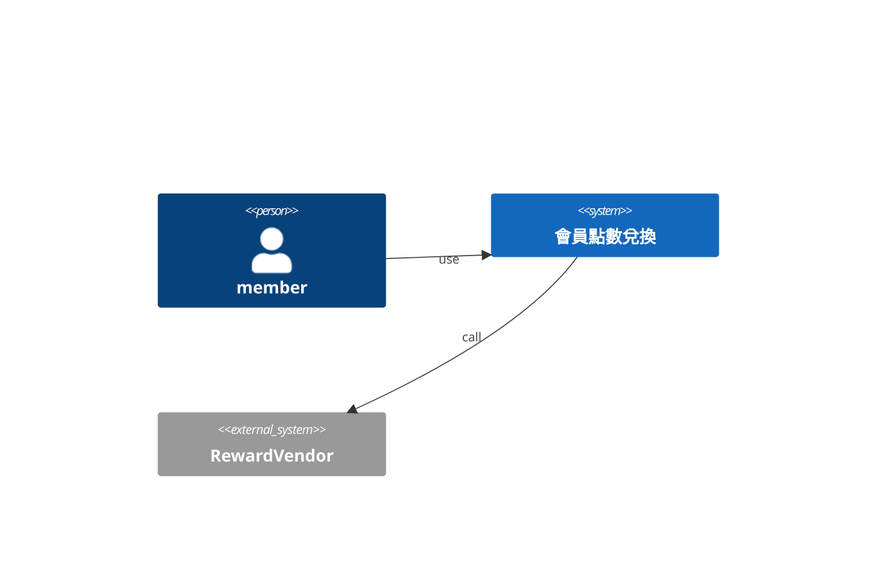
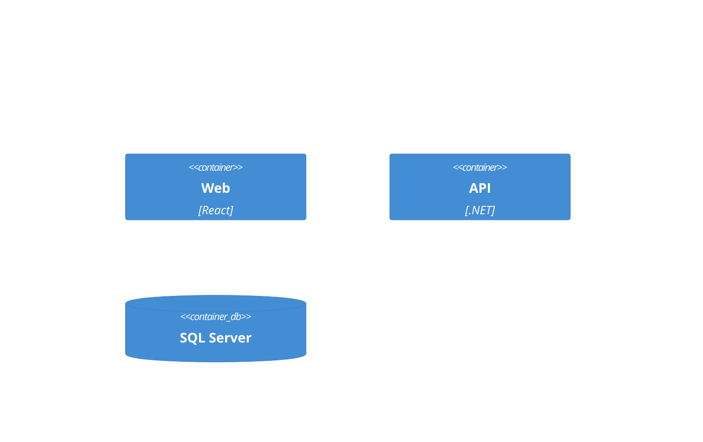
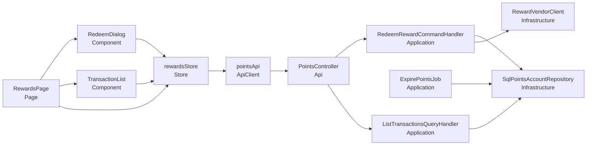
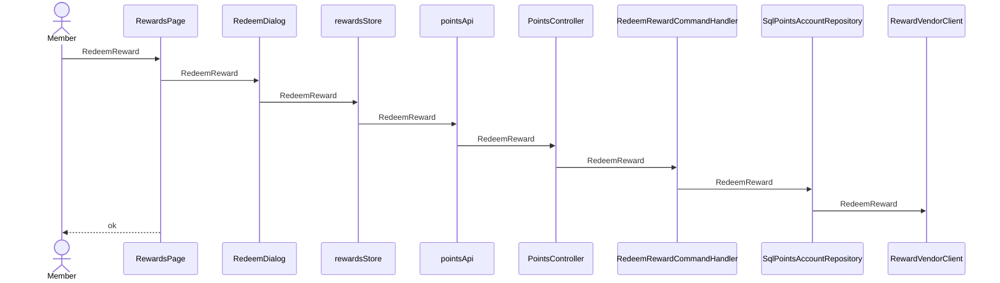
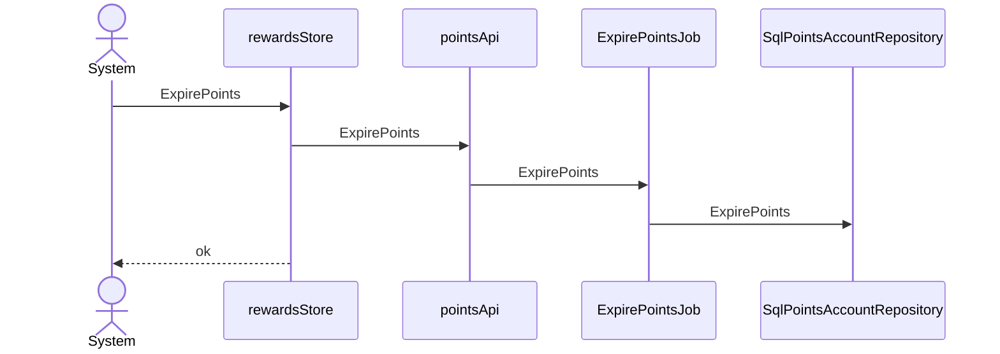
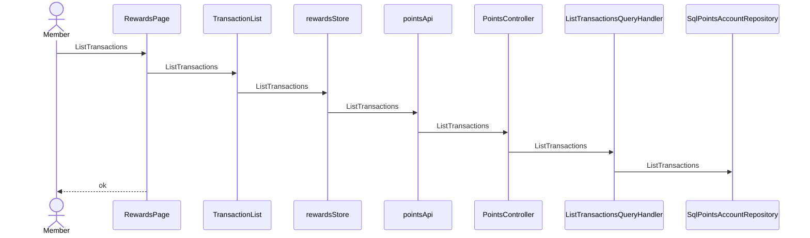

# 會員點數兌換 — architecture (C4)

## Context(L1)
### C4-L1

## Container(L2)
### C4-L2

## Component(L3)
| ID | 名稱 | Layer | Context | depends | external | 技術 |
|---|---|---|---|---|---|---|
| CMP-001 | RewardsPage | Page | Loyalty | CMP-002, CMP-003, CMP-004 |  | React |
| CMP-002 | RedeemDialog | Component | Loyalty | CMP-004 |  | React |
| CMP-003 | TransactionList | Component | Loyalty | CMP-004 |  | React |
| CMP-004 | rewardsStore | Store | Loyalty | CMP-005 |  | Zustand |
| CMP-005 | pointsApi | ApiClient | Loyalty | CMP-006 |  |  |
| CMP-006 | PointsController | Api | Loyalty | CMP-007, CMP-009 |  | ASP.NET Core |
| CMP-007 | RedeemRewardCommandHandler | Application | Loyalty | CMP-010, CMP-011 |  | MediatR |
| CMP-008 | ExpirePointsJob | Application | Loyalty | CMP-010 |  | ASP.NET Core |
| CMP-009 | ListTransactionsQueryHandler | Application | Loyalty | CMP-010 |  | MediatR |
| CMP-010 | SqlPointsAccountRepository : IPointsAccountRepository | Infrastructure | Loyalty |  |  | EF Core |
| CMP-011 | RewardVendorClient : IRewardVendor | Infrastructure | Loyalty |  | RewardVendor |  |

### C4-L3

## 追溯(AC → 技術元件)
| AC | CMP | via | 職責 |
|---|---|---|---|
| AC-001-1 | CMP-001 | SEQ-001 | 顯示並觸發redeem |
| AC-001-1 | CMP-002 | SEQ-001 | redeem的 UI 守衛 |
| AC-001-1 | CMP-004 | SEQ-001 | redeem的前端狀態轉移 |
| AC-001-1 | CMP-005 | SEQ-001 | 呼叫redeem API |
| AC-001-1 | CMP-006 | SEQ-001 | 接收redeem請求 |
| AC-001-1 | CMP-007 | SEQ-001 | 編排redeem |
| AC-001-1 | CMP-010 | SEQ-001 | 持久化redeem結果 |
| AC-001-1 | CMP-011 | SEQ-001 | 為redeem呼叫外部系統 |
| AC-001-2 | CMP-001 | SEQ-001 | 顯示並觸發redeem |
| AC-001-2 | CMP-002 | SEQ-001 | redeem的 UI 守衛 |
| AC-001-2 | CMP-004 | SEQ-001 | redeem的前端狀態轉移 |
| AC-001-2 | CMP-005 | SEQ-001 | 呼叫redeem API |
| AC-001-2 | CMP-006 | SEQ-001 | 接收redeem請求 |
| AC-001-2 | CMP-007 | SEQ-001 | 編排redeem |
| AC-001-2 | CMP-010 | SEQ-001 | 持久化redeem結果 |
| AC-001-2 | CMP-011 | SEQ-001 | 為redeem呼叫外部系統 |
| AC-002-1 | CMP-004 | SEQ-002 | expire的前端狀態轉移 |
| AC-002-1 | CMP-005 | SEQ-002 | 呼叫expire API |
| AC-002-1 | CMP-008 | SEQ-002 | 編排expire |
| AC-002-1 | CMP-010 | SEQ-002 | 持久化expire結果 |
| AC-003-1 | CMP-001 | SEQ-003 | 顯示並觸發view |
| AC-003-1 | CMP-003 | SEQ-003 | view的 UI 守衛 |
| AC-003-1 | CMP-004 | SEQ-003 | view的前端狀態轉移 |
| AC-003-1 | CMP-005 | SEQ-003 | 呼叫view API |
| AC-003-1 | CMP-006 | SEQ-003 | 接收view請求 |
| AC-003-1 | CMP-009 | SEQ-003 | 編排view |
| AC-003-1 | CMP-010 | SEQ-003 | 持久化view結果 |
| AC-N01-1 | CMP-006 | API-001 | NFR balance never negative |

## Sequence
### SEQ-001 (UC-001 / REQ-001)

### SEQ-002 (UC-002 / REQ-002)

### SEQ-003 (UC-003 / REQ-003)

