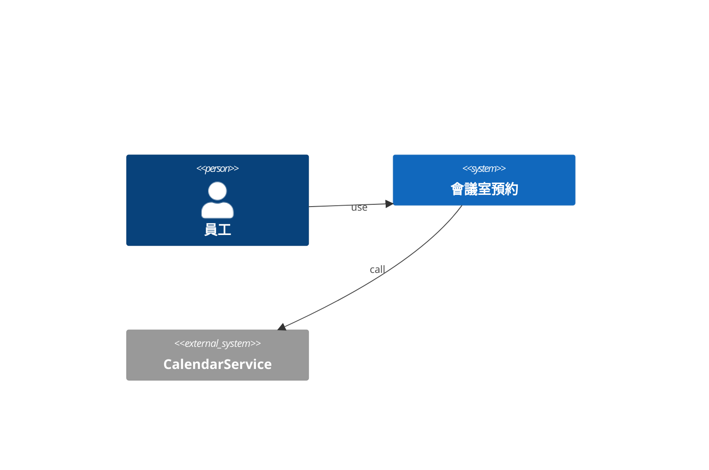
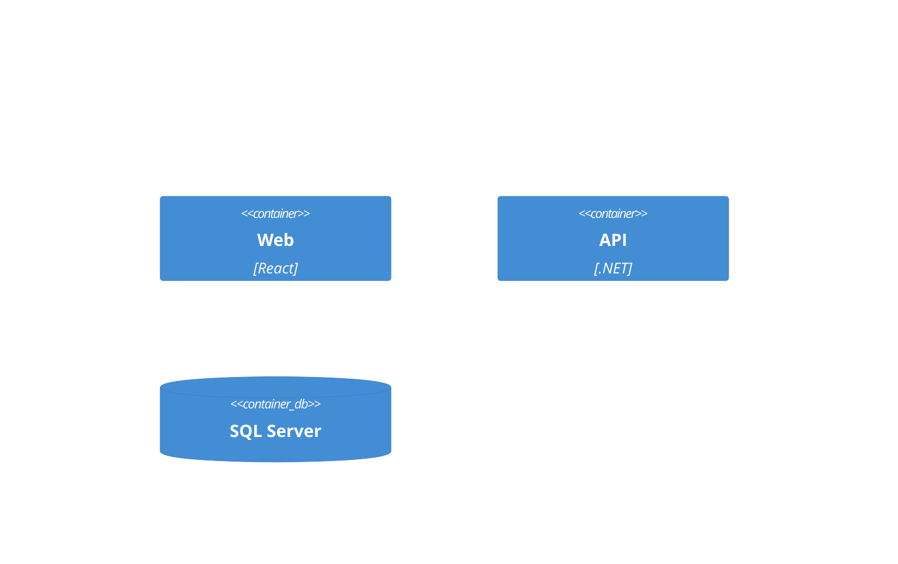
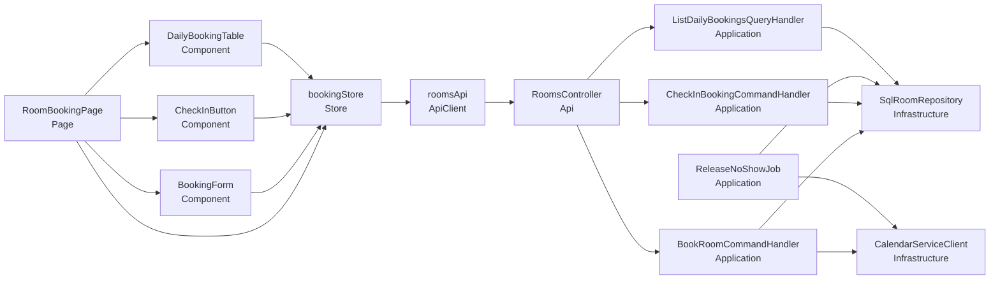
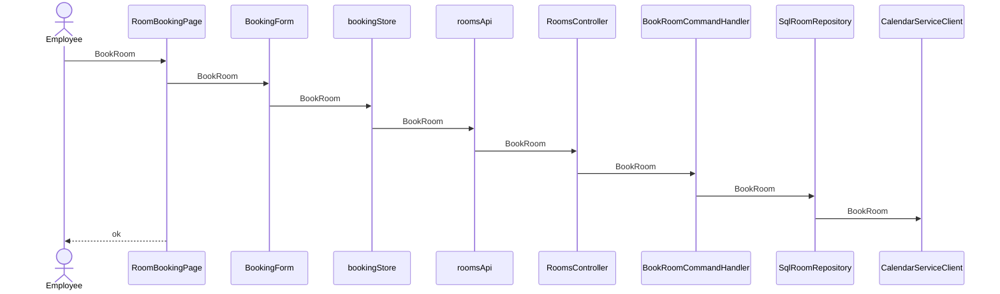

# 會議室預約 — architecture (C4)

## Context(L1)
### C4-L1

## Container(L2)
### C4-L2

## Component(L3)
| ID | 名稱 | Layer | Context | depends | external | 技術 |
|---|---|---|---|---|---|---|
| CMP-001 | RoomBookingPage | Page | Rooms | CMP-002, CMP-003, CMP-004, CMP-005 |  | React |
| CMP-002 | BookingForm | Component | Rooms | CMP-005 |  | React |
| CMP-003 | CheckInButton | Component | Rooms | CMP-005 |  | React |
| CMP-004 | DailyBookingTable | Component | Rooms | CMP-005 |  | React |
| CMP-005 | bookingStore | Store | Rooms | CMP-006 |  | Zustand |
| CMP-006 | roomsApi | ApiClient | Rooms | CMP-007 |  |  |
| CMP-007 | RoomsController | Api | Rooms | CMP-008, CMP-009, CMP-011 |  | ASP.NET Core |
| CMP-008 | BookRoomCommandHandler | Application | Rooms | CMP-012, CMP-013 |  | MediatR |
| CMP-009 | CheckInBookingCommandHandler | Application | Rooms | CMP-012 |  | MediatR |
| CMP-010 | ReleaseNoShowJob | Application | Rooms | CMP-012, CMP-013 |  | ASP.NET Core |
| CMP-011 | ListDailyBookingsQueryHandler | Application | Rooms | CMP-012 |  | MediatR |
| CMP-012 | SqlRoomRepository : IRoomRepository | Infrastructure | Rooms |  |  | EF Core |
| CMP-013 | CalendarServiceClient : ICalendarService | Infrastructure | Rooms |  | CalendarService |  |

### C4-L3

## 追溯(AC → 技術元件)
| AC | CMP | via | 職責 |
|---|---|---|---|
| AC-001-1 | CMP-001 | SEQ-001 | 顯示並觸發預約 |
| AC-001-1 | CMP-002 | SEQ-001 | 預約的 UI 守衛 |
| AC-001-1 | CMP-005 | SEQ-001 | 預約的前端狀態轉移 |
| AC-001-1 | CMP-006 | SEQ-001 | 呼叫預約 API |
| AC-001-1 | CMP-007 | SEQ-001 | 接收預約請求 |
| AC-001-1 | CMP-008 | SEQ-001 | 編排預約 |
| AC-001-1 | CMP-012 | SEQ-001 | 持久化預約結果 |
| AC-001-1 | CMP-013 | SEQ-001 | 為預約呼叫外部系統 |
| AC-001-2 | CMP-001 | SEQ-001 | 顯示並觸發預約 |
| AC-001-2 | CMP-002 | SEQ-001 | 預約的 UI 守衛 |
| AC-001-2 | CMP-005 | SEQ-001 | 預約的前端狀態轉移 |
| AC-001-2 | CMP-006 | SEQ-001 | 呼叫預約 API |
| AC-001-2 | CMP-007 | SEQ-001 | 接收預約請求 |
| AC-001-2 | CMP-008 | SEQ-001 | 編排預約 |
| AC-001-2 | CMP-012 | SEQ-001 | 持久化預約結果 |
| AC-001-2 | CMP-013 | SEQ-001 | 為預約呼叫外部系統 |
| AC-002-1 | CMP-001 | SEQ-001 | 顯示並觸發報到 |
| AC-002-1 | CMP-003 | SEQ-001 | 報到的 UI 守衛 |
| AC-002-1 | CMP-005 | SEQ-001 | 報到的前端狀態轉移 |
| AC-002-1 | CMP-006 | SEQ-001 | 呼叫報到 API |
| AC-002-1 | CMP-007 | SEQ-001 | 接收報到請求 |
| AC-002-1 | CMP-009 | SEQ-001 | 編排報到 |
| AC-002-1 | CMP-012 | SEQ-001 | 持久化報到結果 |
| AC-002-1 | CMP-010 | SEQ-001 | 編排釋放 |
| AC-002-1 | CMP-013 | SEQ-001 | 為釋放呼叫外部系統 |
| AC-002-2 | CMP-001 | SEQ-001 | 顯示並觸發報到 |
| AC-002-2 | CMP-003 | SEQ-001 | 報到的 UI 守衛 |
| AC-002-2 | CMP-005 | SEQ-001 | 報到的前端狀態轉移 |
| AC-002-2 | CMP-006 | SEQ-001 | 呼叫報到 API |
| AC-002-2 | CMP-007 | SEQ-001 | 接收報到請求 |
| AC-002-2 | CMP-009 | SEQ-001 | 編排報到 |
| AC-002-2 | CMP-012 | SEQ-001 | 持久化報到結果 |
| AC-002-2 | CMP-010 | SEQ-001 | 編排釋放 |
| AC-002-2 | CMP-013 | SEQ-001 | 為釋放呼叫外部系統 |
| AC-003-1 | CMP-001 | SEQ-001 | 顯示並觸發查看 |
| AC-003-1 | CMP-004 | SEQ-001 | 查看的 UI 守衛 |
| AC-003-1 | CMP-005 | SEQ-001 | 查看的前端狀態轉移 |
| AC-003-1 | CMP-006 | SEQ-001 | 呼叫查看 API |
| AC-003-1 | CMP-007 | SEQ-001 | 接收查看請求 |
| AC-003-1 | CMP-011 | SEQ-001 | 編排查看 |
| AC-003-1 | CMP-012 | SEQ-001 | 持久化查看結果 |
| AC-N01-1 | CMP-007 | API-001 | NFR 100 concurrent → 1 success |

## Sequence
### SEQ-001 (UC-001 / REQ-001)

