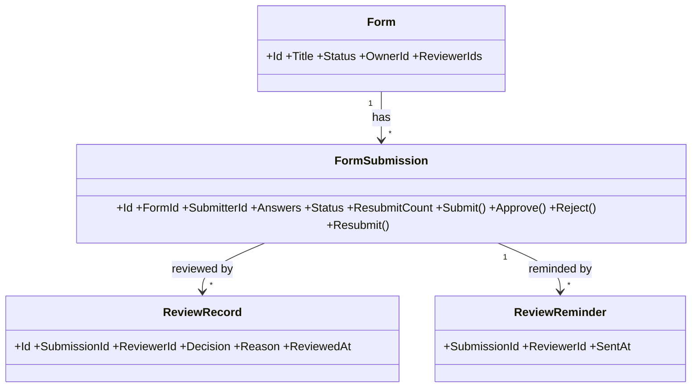

# issue-c SA2 實體與關係

## 實體
| 實體 | 英文 | 屬性 | 來源詞 |
|---|---|---|---|
| 表單 | Form | Id, Title, Status, OwnerId, Fields, ReviewerIds(新) | 表單、指派 |
| 填寫紀錄 | FormSubmission | Id, FormId, SubmitterId, Answers, SubmittedAt, Status(新:Pending/Approved/Rejected), ResubmitCount(新) | 填寫紀錄、待審核 |
| 審核紀錄 | ReviewRecord | Id, SubmissionId, ReviewerId, Decision, Reason, ReviewedAt | 審核紀錄、理由 |
| 提醒 | ReviewReminder | SubmissionId, ReviewerId, SentAt | 提醒、工作天 |

同義合併:送出/送審 → Submit;待審核 = Pending。屬性詞(理由、工作天)不建實體。
「審核者指派」PM 未展開:暫以 Form.ReviewerIds 表達,列入缺口。

## 關係
| 來源 | 關係 | 目標 | 多重性 |
|---|---|---|---|
| Form | has | FormSubmission | 1..* |
| FormSubmission | reviewed by | ReviewRecord | 0..* |
| Form | assigned | Reviewer | 1..* |
| FormSubmission | reminded by | ReviewReminder | 0..* |

### CLS-SA-001 實體關係(REQ-001)

