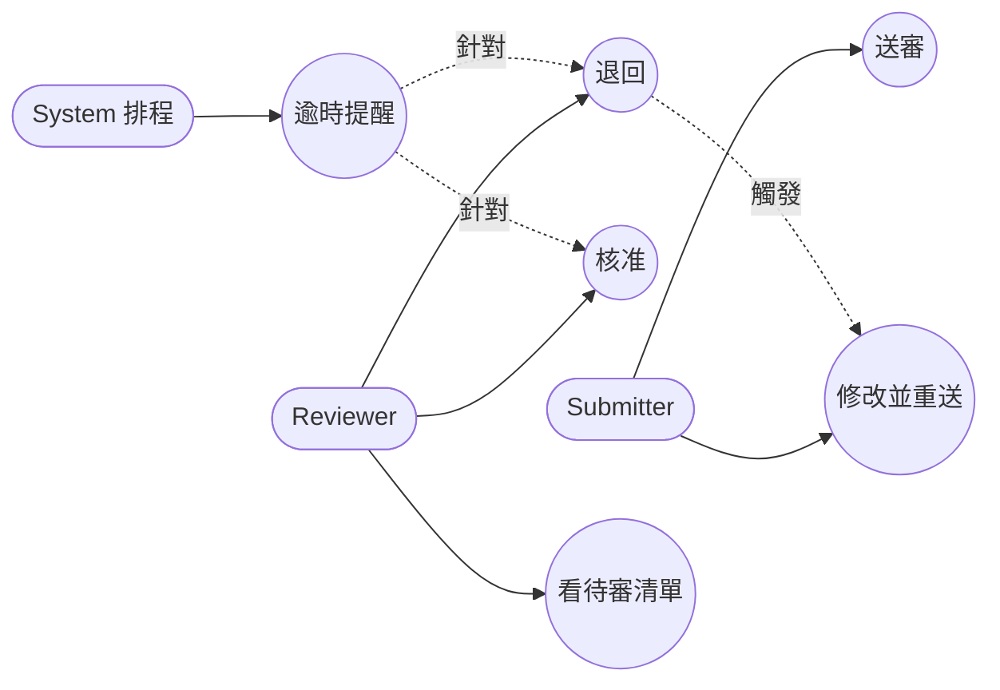

# issue-c SA4 Use Case Diagram

mermaid 無原生 use case 圖,以 flowchart LR 表達 Actor–UseCase。

## Use Case Diagram
### UCD-001 表單審核(REQ-001)

```mermaid
flowchart LR
  S([Submitter]) --> UC1((送審))
  S --> UC3((修改並重送))
  R([Reviewer]) --> UC2a((核准))
  R --> UC2b((退回))
  R --> UC2c((看待審清單))
  SYS([System 排程]) --> UC4((逾時提醒))
  UC2b -. 觸發 .-> UC3
  UC4 -. 針對 .-> UC2a
  UC4 -. 針對 .-> UC2b
```
