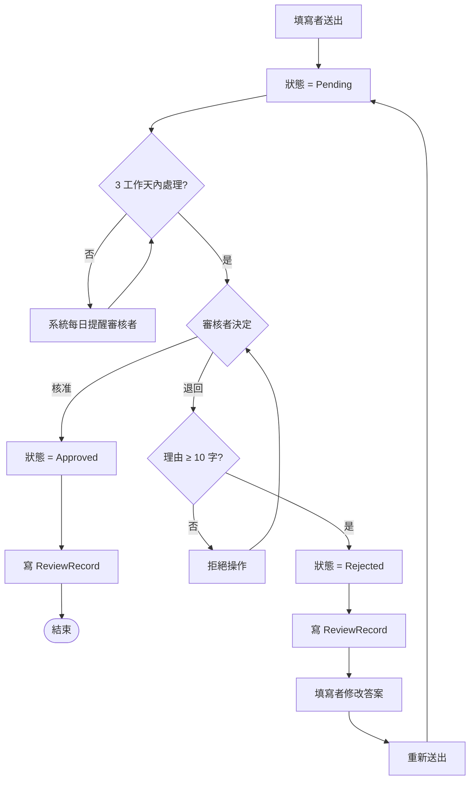

# issue-c SA5 Activity Diagram

## Activity Diagram
### ACT-001 審核主流程(REQ-002)

```mermaid
flowchart TD
  A[填寫者送出] --> B[狀態 = Pending]
  B --> C{3 工作天內處理?}
  C -->|否| D[系統每日提醒審核者] --> C
  C -->|是| E{審核者決定}
  E -->|核准| F[狀態 = Approved] --> G[寫 ReviewRecord] --> H([結束])
  E -->|退回| I{理由 ≥ 10 字?}
  I -->|否| J[拒絕操作] --> E
  I -->|是| K[狀態 = Rejected] --> L[寫 ReviewRecord] --> M[填寫者修改答案]
  M --> N[重新送出] --> B
```
