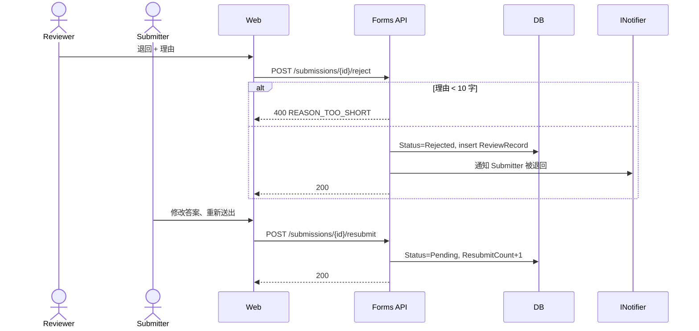

# issue-c SA6 Sequence Diagram

系統層級(Web / API / DB / 通知),不到 Component;Component 層在 RD spec 30。

## Sequence Diagram
### SEQ-SA-001 退回與重送(REQ-002 / REQ-003)

```mermaid
sequenceDiagram
  actor R as Reviewer
  actor S as Submitter
  participant W as Web
  participant A as Forms API
  participant D as DB
  participant N as INotifier
  R->>W: 退回 + 理由
  W->>A: POST /submissions/{id}/reject
  alt 理由 < 10 字
    A-->>W: 400 REASON_TOO_SHORT
  else
    A->>D: Status=Rejected, insert ReviewRecord
    A->>N: 通知 Submitter 被退回
    A-->>W: 200
  end
  S->>W: 修改答案、重新送出
  W->>A: POST /submissions/{id}/resubmit
  A->>D: Status=Pending, ResubmitCount+1
  A-->>W: 200
```
