# issue-c SA7 State Diagram

## State Diagram
### STM-SA-001 FormSubmission.Status(REQ-001)

```mermaid
stateDiagram-v2
  [*] --> Pending: Submit
  Pending --> Approved: Approve [reviewer assigned]
  Pending --> Rejected: Reject [reason >= 10]
  Rejected --> Pending: Resubmit
  Approved --> [*]
  note right of Pending: 超過 3 工作天每日 Remind;Submitter 不可 Edit
  note right of Rejected: Submitter 可 Edit
  note right of Approved: 不可 Edit、不可 Resubmit
```

對回 02:Status 是 FormSubmission 的屬性;Approve/Reject/Resubmit 是 FormSubmission 的方法(狀態機放 Domain,依 guidelines)。
