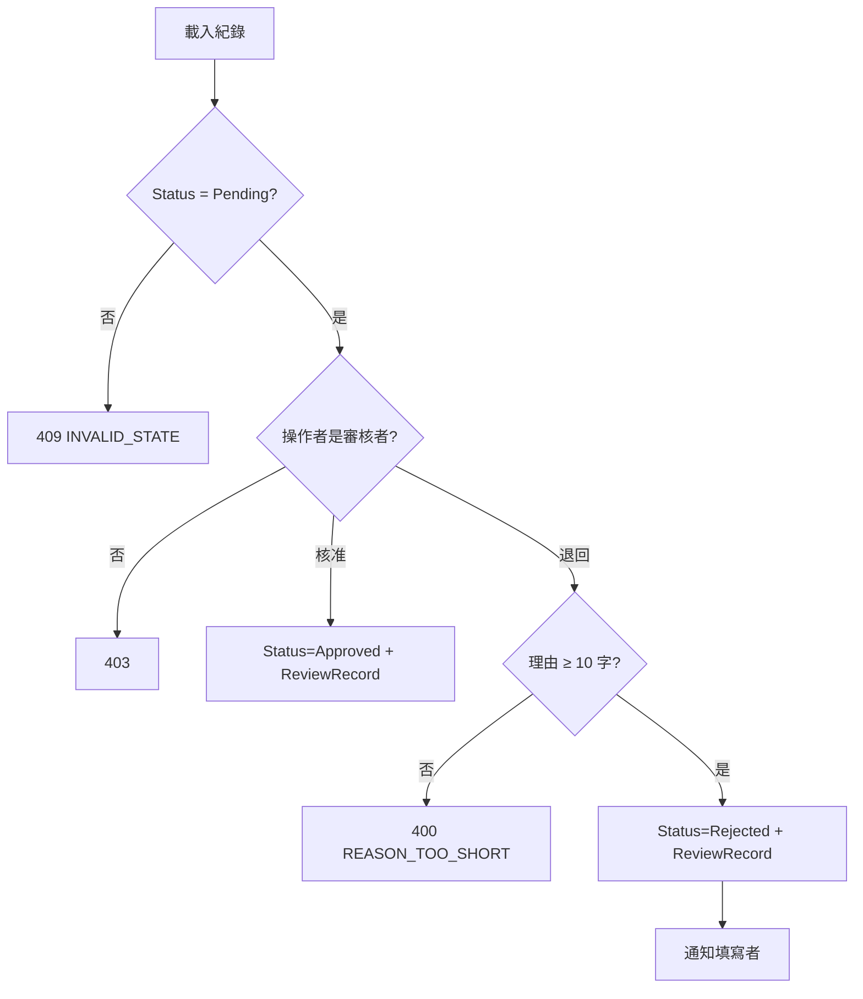
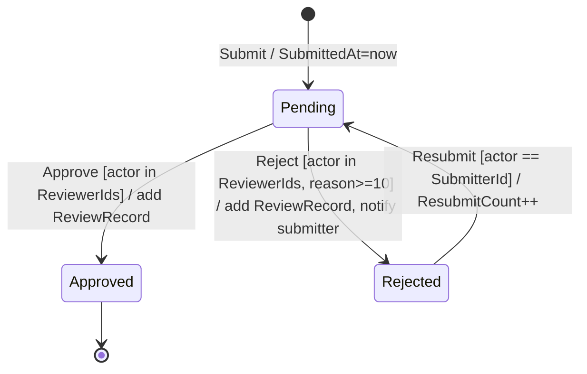
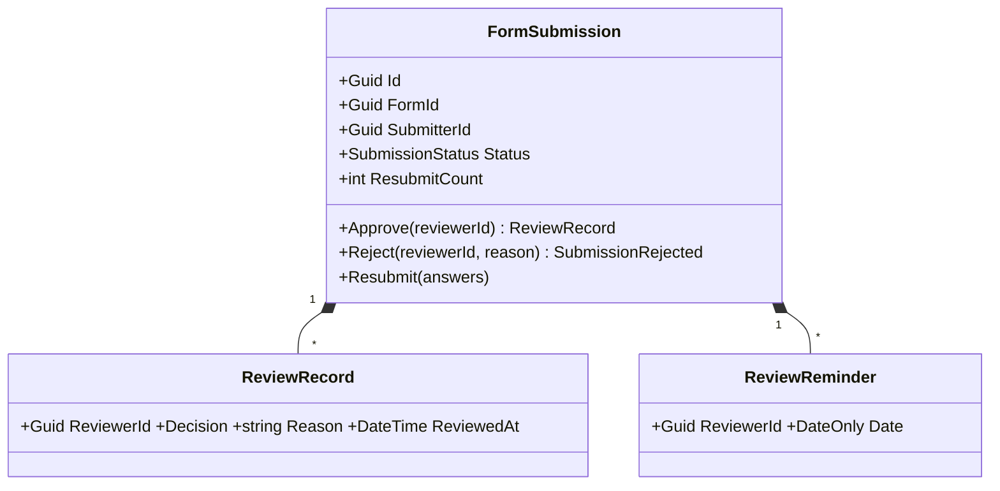

# 表單審核流程 — 領域模型

## Use Case
### UC-001 送審(REQ-001)
- 主要參與者:Submitter
- 觸發:填寫者送出答案
- 前置條件:表單已發布;必填欄位齊全(issue-b 既有規則)
- 後置條件(成功保證):FormSubmission.Status = Pending;SubmittedAt 更新;填寫者端不可編輯
- 主流程:
  1. 建立 FormSubmission(既有)
  2. Status 設為 Pending(新)
- 替代流程:無
- 例外流程:必填缺漏 → 400(既有)

### UC-002 審核(REQ-002)
- 主要參與者:Reviewer
- 觸發:審核者在待審清單選一筆,核准或退回
- 前置條件:Status = Pending;操作者 ∈ Form.ReviewerIds
- 後置條件(成功保證):Status ∈ {Approved, Rejected};新增一筆不可變 ReviewRecord;Rejected 時填寫者收到通知
- 主流程:
  1. 載入 FormSubmission 與 Form
  2. 檢查操作者是指派審核者
  3. Approve 或 Reject(reason)
  4. 儲存;Rejected → INotifier 通知填寫者
- 替代流程:無
- 例外流程:3a 理由 < 10 字 → 400 REASON_TOO_SHORT;2a 非審核者 → 403;1a Status ≠ Pending → 409

### UC-003 重送(REQ-003)
- 主要參與者:Submitter
- 觸發:填寫者修改答案後重新送出
- 前置條件:Status = Rejected;操作者 = SubmitterId
- 後置條件(成功保證):Status = Pending;ResubmitCount + 1;Answers 更新
- 主流程:
  1. 載入 FormSubmission
  2. 驗證答案(既有必填規則)
  3. Resubmit(answers)
- 替代流程:無
- 例外流程:Status ∈ {Pending, Approved} → 409 SUBMISSION_LOCKED

### UC-004 逾時提醒(REQ-004)
- 主要參與者:System(每日排程)
- 觸發:每日 09:00
- 前置條件:無
- 後置條件(成功保證):每筆逾時 Pending 紀錄,今日對每位審核者恰好提醒一次,且寫入 ReviewReminder
- 主流程:
  1. 查詢 Pending 且 SubmittedAt + 3 工作天 < 今日 的紀錄
  2. 排除今日已提醒者
  3. 經 INotifier 發提醒;寫 ReviewReminder
- 替代流程:無
- 例外流程:INotifier 失敗 → 記 log、該筆不寫 ReviewReminder,隔日重試

## 狀態機
### STM-DOM-001 FormSubmission.Status(REQ-001)
沿用 SA7 的 STM-SA-001,補守衛與動作。

### 介面狀態
### STM-UI-001 紀錄頁按鈕(REQ-001)

```mermaid
stateDiagram-v2
  [*] --> Pending
  Pending --> Approved: 200 approve
  Pending --> Rejected: 200 reject
  Rejected --> Pending: 200 resubmit
  note right of Pending: 修改=disabled;審核者看到核准/退回
  note right of Rejected: 修改=enabled;重新送出=visible
  note right of Approved: 全部 disabled
```

## 領域模型
FormSubmission 有生命週期(Pending → Approved/Rejected)且有跨物件一致性(狀態轉移必須同時產生 ReviewRecord)→ 是 Aggregate Root。ReviewRecord 無獨立生命週期 → Aggregate 內 Entity。ReviewReminder 只是防重複的紀錄 → Aggregate 內 Entity。Form 只加 ReviewerIds(VO)。

| 類型 | 名稱 | 不變量 | 所屬 Aggregate | 來源 UC 後置條件 |
|---|---|---|---|---|
| Aggregate Root | FormSubmission | 狀態轉移只能經 Submit/Approve/Reject/Resubmit;每次 Approve/Reject 恰好新增一筆 ReviewRecord | FormSubmission | UC-001, UC-002, UC-003 |
| Entity | ReviewRecord | 建立後不可變;Rejected 的 Reason.Length ≥ 10 | FormSubmission | UC-002 |
| Entity | ReviewReminder | (SubmissionId, ReviewerId, Date) 唯一 | FormSubmission | UC-004 |
| Value Object | ReviewerIds | 非空集合 | Form | UC-002 |
| Domain Event | SubmissionRejected(SubmissionId, SubmitterId, Reason) | 必觸發通知 | FormSubmission | UC-002 |

### CLS-001 FormSubmission(REQ-002)

